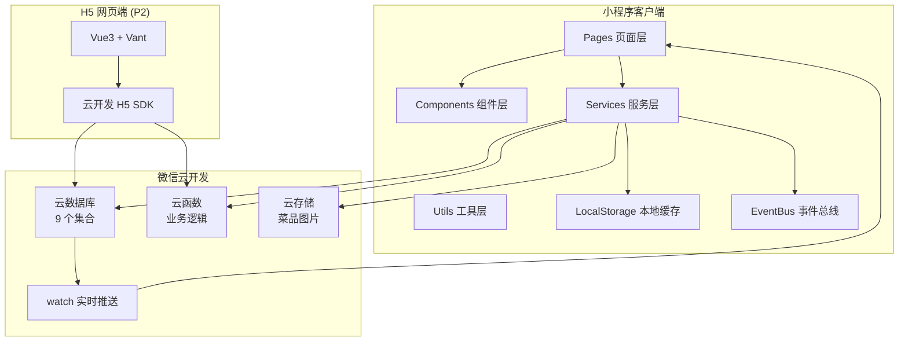
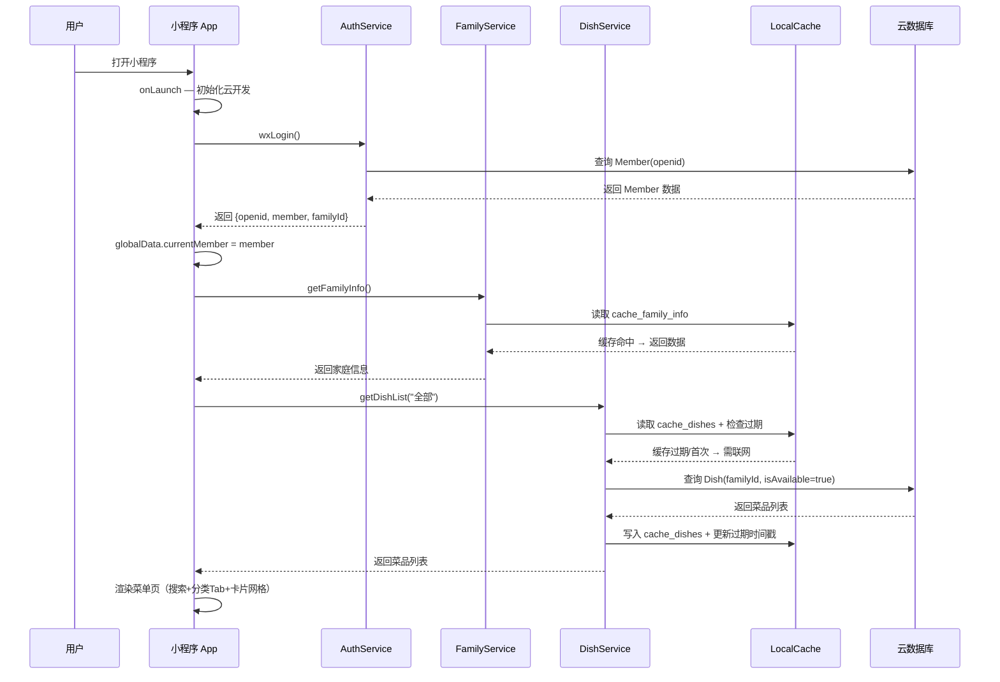
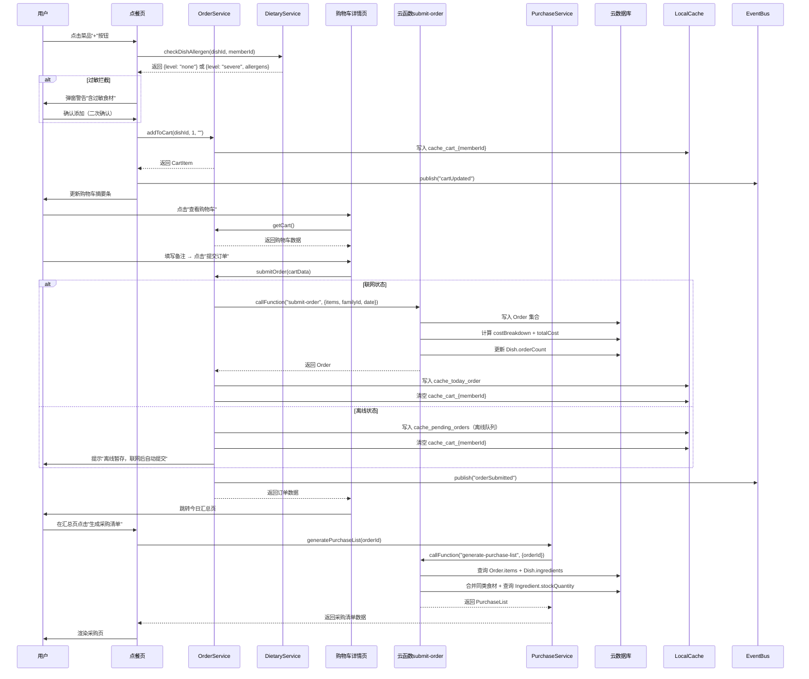
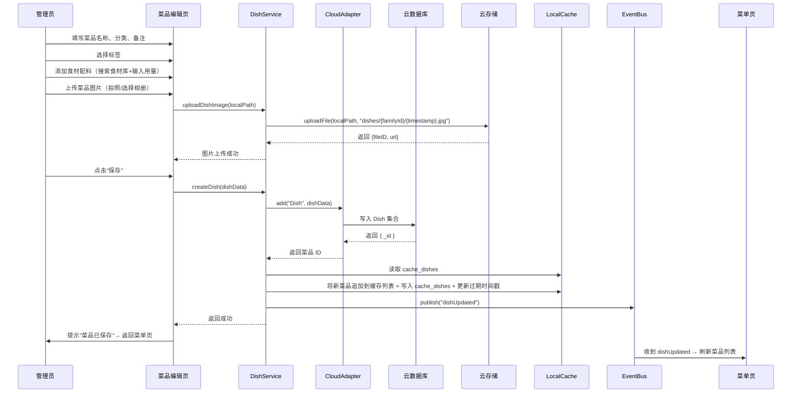
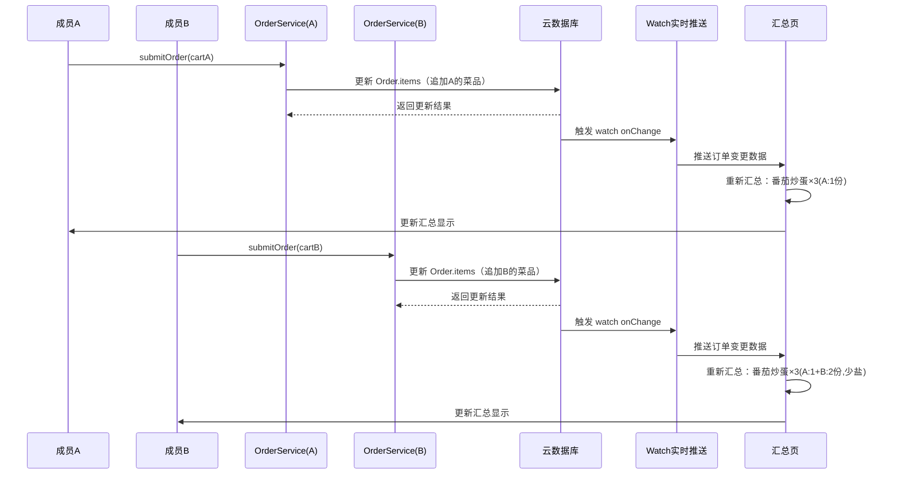

# 家庭点菜小程序 — 系统架构设计 + 任务分解

> 项目代号：`family_order`
> 文档版本：v1.0
> 创建日期：2026-07-02
> 作者：高见远（Gao）· 架构师
> 输入依据：`family-order-prd.md`（PRD）、`family-order-ui-spec.md`（UI 规格）

---

## 一、实现方案与框架选型

### 1.1 技术栈确认

| 层级 | 技术选型 | 理由 |
|------|----------|------|
| 前端框架 | 微信小程序原生（WXML + WXSS + JS） | PRD 明确要求原生开发，不引入第三方框架保持轻量；原生 API 访问能力最强 |
| UI 组件库 | 自建组件库（基于 WXSS + WXML） | 家庭场景 UI 定制需求高（大字体、适老化），第三方库样式覆盖成本大于自建 |
| 状态管理 | `app.globalData` + 页面级 `data` + 事件总线 `EventBus` | 小程序无 Redux 等全局状态库，通过 `globalData` 共享家庭/用户等全局数据，`EventBus` 跨页面通信 |
| 数据存储（云端） | 微信云开发 — 云数据库 | 无需自建服务器，内置权限控制，天然支持 `watch` 实时推送 |
| 数据存储（本地） | `wx.setStorageSync` / `wx.getStorageSync` | 离线浏览、购物车暂存、缓存菜品列表 |
| 图片存储 | 微信云存储（`wx.cloud.uploadFile`） | CloudFileID + CDN 加速，2MB/张上限 |
| 服务端逻辑 | 微信云函数（Node.js 12+） | 订单汇总、成本计算、数据备份等需要服务端保障一致性的操作 |
| 实时同步 | 云数据库 `watch` API | 多人同时点餐数据实时合并，1-3 秒延迟 |
| 图表渲染 | `wx-canvas` 自绘 + `echarts-for-weixin`（可选） | 统计页月度柱状图，优先用 Canvas 自绘，复杂场景可引入 ECharts 小程序版 |
| 分享能力 | `wx.shareAppMessage` + `onShareTimeline` | 点餐清单/采购清单转发微信群 |
| H5 网页端（P2） | 微信云开发 H5 SDK | 同一云数据库，同一套云函数，H5 前端用 Vue 3 + Vant |

### 1.2 整体架构图



**架构分层说明**：

| 层 | 职责 | 关键约定 |
|----|------|----------|
| Pages 页面层 | 5 个主页面 + 10+ 子页面，负责 UI 渲染与用户交互 | 每个页面通过 Service 层获取数据，不直接操作云数据库 |
| Components 组件层 | 可复用 UI 组件（菜品卡片、购物车条、分类 Tab 等） | 组件通过 `properties` 接收数据，通过 `triggerEvent` 向页面回传操作 |
| Services 服务层 | 业务逻辑封装（菜品服务、订单服务、采购服务等） | 每个服务是一个单例 module，统一提供 `cloud` / `cache` 双通道 |
| Utils 工具层 | 通用工具（日期、金额、单位换算、校验等） | 纯函数，不依赖任何业务状态 |
| EventBus 事件总线 | 跨页面通信（购物车更新、订单提交、数据同步完成等） | `publish/subscribe` 模式，解耦页面间联动 |
| LocalStorage 本地缓存 | 离线数据暂存、性能优化缓存 | 所有缓存 Key 以 `cache_` 前缀，统一过期策略 |
| 云数据库 | 9 个集合（Family, Member, MemberDietary, Dish, Tag, Ingredient, Order, Rating, WeeklyMenu） | 所有集合以 `familyId` 为必带过滤条件，确保家庭数据隔离 |
| 云函数 | 服务端逻辑（订单汇总、成本计算、数据导出、家庭码生成等） | 权限校验在云函数入口统一执行 |
| 云存储 | 菜品图片（1-3 张/菜品） | CloudFileID 格式，自动 CDN 加速 |

### 1.3 多端数据同步策略（小程序端与 H5 端）

> 注：H5 网页端属于 P2 需求，以下策略为架构预留设计。

| 维度 | 方案 |
|------|------|
| 数据源 | 小程序端和 H5 端共用同一微信云开发环境（同一 `envId`） |
| 身份互通 | 小程序端用 `wx.cloud.callFunction` 获取 openid；H5 端用微信云开发 H5 SDK + 微信网页授权获取同一 openid |
| 数据隔离 | 两端查询均以 `familyId` 为过滤条件，云函数统一校验权限 |
| 实时同步 | 小程序端用 `watch` API；H5 端用轮询（每 5 秒）或 WebSocket（云开发后续可能支持） |
| UI 适配 | H5 端独立布局（Vue3 + Vant），但共用 Service 层的数据模型和接口协议 |

### 1.4 离线策略

| 策略 | 实现方式 |
|------|----------|
| 数据缓存 | 首次联网时全量拉取上架菜品、食材库、家庭信息存入 `wx.setStorageSync` |
| 购物车暂存 | 购物车数据写入 `cache_cart_{memberId}`，网络恢复后自动提交 |
| 订单离线队列 | 提交失败时订单入队 `cache_pending_orders`，监听 `wx.onNetworkStatusChange`，恢复后逐条上传 |
| 缓存过期 | 菜品/食材缓存 24 小时自动过期（`cache_dishes_expire` timestamp），过期后联网刷新 |
| 离线提示 | `wx.onNetworkStatusChange` 监听，断网时页面顶部显示"当前离线"提示条 |
| 离线限制 | 离线不可提交订单、不可编辑菜品、不可查看实时汇总；可浏览菜单、加购、设忌口 |

---

## 二、文件目录结构

```
family_order/
├── miniprogram/                    # 小程序主目录
│   ├── app.js                      # 小程序入口 — 全局数据、生命周期、云开发初始化
│   ├── app.json                    # 全局配置 — 页面路由、TabBar、窗口样式
│   ├── app.wxss                    # 全局样式 — CSS 变量、主题、通用样式
│   ├── sitemap.json                # 小程序索引配置
│   ├── project.config.json         # 项目配置 — AppID、云开发环境
│   ├── cloud.init.js               # 云开发环境初始化辅助
│   │
│   ├── styles/                     # 样式体系
│   │   ├── variables.wxss          # 主题变量（颜色、字号、间距、圆角）
│   │   ├── theme-light.wxss        # 浅色模式样式
│   │   ├── theme-dark.wxss         # 深色模式样式
│   │   ├── mixins.wxss             # 样式混入（卡片阴影、按钮样式等）
│   │   └── global.wxss             # 通用全局样式（布局、间距、字体）
│   │
│   ├── utils/                      # 工具层
│   │   ├── date.js                 # 日期格式化、计算
│   │   ├── money.js                # 金额格式化、计算
│   │   ├── unit.js                 # 食材单位换算
│   │   ├── validator.js            # 输入校验（长度、格式）
│   │   ├── cache.js                # 本地缓存管理（统一读写、过期策略）
│   │   ├── network.js              # 网络状态监听、离线队列
│   │   ├── dietary-check.js        # 忌口/过敏检测算法
│   │   ├── event-bus.js            # 跨页面事件总线
│   │   ├── constants.js            # 常量定义（分类枚举、标签池、角色枚举）
│   │   └── id.js                   # ID 生成（6位家庭码、临时ID等）
│   │
│   ├── services/                   # 服务层 — 业务逻辑封装
│   │   ├── auth-service.js         # 登录/注册/身份管理
│   │   ├── family-service.js       # 家庭创建/加入/成员管理
│   │   ├── dish-service.js         # 菜品 CRUD + 上下架 + 搜索
│   │   ├── tag-service.js          # 标签管理（预设 + 自定义）
│   │   ├── ingredient-service.js   # 食材库 CRUD + 库存管理
│   │   ├── order-service.js        # 点餐下单 + 汇总 + 历史
│   │   ├── purchase-service.js     # 采购清单提取 + 导出
│   │   ├── stats-service.js        # 统计数据计算 + 月度汇总
│   │   ├── dietary-service.js      # 忌口设置 + 过敏拦截
│   │   ├── rating-service.js       # 菜品评分（P1）
│   │   ├── weekly-menu-service.js  # 一周食谱（P1）
│   │   ├── backup-service.js       # 数据备份/恢复（P1）
│   │   └── cloud-adapter.js        # 云开发统一适配层（DB 查询、文件上传封装）
│   │
│   ├── components/                 # 可复用组件
│   │   ├── dish-card/              # 菜品卡片组件
│   │   │   ├── dish-card.js
│   │   │   ├── dish-card.json
│   │   │   ├── dish-card.wxml
│   │   │   ├── dish-card.wxss
│   │   ├── category-tab/           # 分类横向滚动 Tab
│   │   │   ├── category-tab.js
│   │   │   ├── category-tab.json
│   │   │   ├── category-tab.wxml
│   │   │   ├── category-tab.wxss
│   │   ├── cart-bar/               # 购物车摘要条（底部悬浮）
│   │   │   ├── cart-bar.js
│   │   │   ├── cart-bar.json
│   │   │   ├── cart-bar.wxml
│   │   │   ├── cart-bar.wxss
│   │   ├── quantity-stepper/       # 份数加减控件
│   │   │   ├── quantity-stepper.js
│   │   │   ├── quantity-stepper.json
│   │   │   ├── quantity-stepper.wxml
│   │   │   ├── quantity-stepper.wxss
│   │   ├── ingredient-item/        # 食材行（采购/库存列表）
│   │   │   ├── ingredient-item.js
│   │   │   ├── ingredient-item.json
│   │   │   ├── ingredient-item.wxml
│   │   │   ├── ingredient-item.wxss
│   │   ├── empty-state/            # 空状态组件（图标+文字+按钮）
│   │   │   ├── empty-state.js
│   │   │   ├── empty-state.json
│   │   │   ├── empty-state.wxml
│   │   │   ├── empty-state.wxss
│   │   ├── modal-confirm/          # 确认弹窗组件
│   │   │   ├── modal-confirm.js
│   │   │   ├── modal-confirm.json
│   │   │   ├── modal-confirm.wxml
│   │   │   ├── modal-confirm.wxss
│   │   ├── allergen-badge/         # 过敏/忌口标记徽章
│   │   │   ├── allergen-badge.js
│   │   │   ├── allergen-badge.json
│   │   │   ├── allergen-badge.wxml
│   │   │   ├── allergen-badge.wxss
│   │   ├── bar-chart/              # 柱状图组件（统计页）
│   │   │   ├── bar-chart.js
│   │   │   ├── bar-chart.json
│   │   │   ├── bar-chart.wxml
│   │   │   ├── bar-chart.wxss
│   │   ├── tag-pill/               # 标签小药丸组件
│   │   │   ├── tag-pill.js
│   │   │   ├── tag-pill.json
│   │   │   ├── tag-pill.wxml
│   │   │   ├── tag-pill.wxss
│   │   ├── search-bar/             # 搜索框组件
│   │   │   ├── search-bar.js
│   │   │   ├── search-bar.json
│   │   │   ├── search-bar.wxml
│   │   │   ├── search-bar.wxss
│   │   ├── member-avatar/          # 成员头像组件
│   │   │   ├── member-avatar.js
│   │   │   ├── member-avatar.json
│   │   │   ├── member-avatar.wxml
│   │   │   ├── member-avatar.wxss
│   │   ├── offline-banner/         # 离线提示条组件
│   │   │   ├── offline-banner.js
│   │   │   ├── offline-banner.json
│   │   │   ├── offline-banner.wxml
│   │   │   ├── offline-banner.wxss
│   │   ├── tab-switch/             # 页面内 Tab 切换组件
│   │   │   ├── tab-switch.js
│   │   │   ├── tab-switch.json
│   │   │   ├── tab-switch.wxml
│   │   │   ├── tab-switch.wxss
│   │   ├── rating-stars/           # 评分星星组件（P1）
│   │   │   ├── rating-stars.js
│   │   │   ├── rating-stars.json
│   │   │   ├── rating-stars.wxml
│   │   │   ├── rating-stars.wxss
│   │   ├── dish-image/             # 菜品图片组件（渐变占位+实际图片）
│   │   │   ├── dish-image.js
│   │   │   ├── dish-image.json
│   │   │   ├── dish-image.wxml
│   │   │   ├── dish-image.wxss
│   │   ├── skeleton/               # 骨架屏组件
│   │   │   ├── skeleton.js
│   │   │   ├── skeleton.json
│   │   │   ├── skeleton.wxml
│   │   │   ├── skeleton.wxss
│   │
│   ├── pages/                      # 页面层
│   │   ├── menu/                   # 菜单页（TabBar 第 1 项）
│   │   │   ├── menu.js
│   │   │   ├── menu.json
│   │   │   ├── menu.wxml
│   │   │   ├── menu.wxss
│   │   ├── order/                  # 点餐页（TabBar 第 2 项）
│   │   │   ├── order.js
│   │   │   ├── order.json
│   │   │   ├── order.wxml
│   │   │   ├── order.wxss
│   │   ├── purchase/               # 采购页（TabBar 第 3 项）
│   │   │   ├── purchase.js
│   │   │   ├── purchase.json
│   │   │   ├── purchase.wxml
│   │   │   ├── purchase.wxss
│   │   ├── stats/                  # 统计页（TabBar 第 4 项）
│   │   │   ├── stats.js
│   │   │   ├── stats.json
│   │   │   ├── stats.wxml
│   │   │   ├── stats.wxss
│   │   ├── profile/                # 我的页（TabBar 第 5 项）
│   │   │   ├── profile.js
│   │   │   ├── profile.json
│   │   │   ├── profile.wxml
│   │   │   ├── profile.wxss
│   │   ├── login/                  # 登录/加入家庭页
│   │   │   ├── login.js
│   │   │   ├── login.json
│   │   │   ├── login.wxml
│   │   │   ├── login.wxss
│   │   ├── dish-detail/            # 菜品详情页
│   │   │   ├── dish-detail.js
│   │   │   ├── dish-detail.json
│   │   │   ├── dish-detail.wxml
│   │   │   ├── dish-detail.wxss
│   │   ├── dish-edit/              # 菜品新增/编辑页
│   │   │   ├── dish-edit.js
│   │   │   ├── dish-edit.json
│   │   │   ├── dish-edit.wxml
│   │   │   ├── dish-edit.wxss
│   │   ├── cart/                   # 购物车详情页
│   │   │   ├── cart.js
│   │   │   ├── cart.json
│   │   │   ├── cart.wxml
│   │   │   ├── cart.wxss
│   │   ├── order-summary/          # 今日点餐汇总页
│   │   │   ├── order-summary.js
│   │   │   ├── order-summary.json
│   │   │   ├── order-summary.wxml
│   │   │   ├── order-summary.wxss
│   │   ├── order-history/          # 历史点餐记录页
│   │   │   ├── order-history.js
│   │   │   ├── order-history.json
│   │   │   ├── order-history.wxml
│   │   │   ├── order-history.wxss
│   │   ├── inventory/              # 食材库存管理页
│   │   │   ├── inventory.js
│   │   │   ├── inventory.json
│   │   │   ├── inventory.wxml
│   │   │   ├── inventory.wxss
│   │   ├── ingredient-edit/        # 食材新增/编辑页
│   │   │   ├── ingredient-edit.js
│   │   │   ├── ingredient-edit.json
│   │   │   ├── ingredient-edit.wxml
│   │   │   ├── ingredient-edit.wxss
│   │   ├── dietary/                # 忌口设置页
│   │   │   ├── dietary.js
│   │   │   ├── dietary.json
│   │   │   ├── dietary.wxml
│   │   │   ├── dietary.wxss
│   │   ├── family-manage/          # 家庭管理页（管理员专属）
│   │   │   ├── family-manage.js
│   │   │   ├── family-manage.json
│   │   │   ├── family-manage.wxml
│   │   │   ├── family-manage.wxss
│   │   ├── favorites/              # 我的收藏页（P1）
│   │   │   ├── favorites.js
│   │   │   ├── favorites.json
│   │   │   ├── favorites.wxml
│   │   │   ├── favorites.wxss
│   │   ├── weekly-menu/            # 一周食谱页（P1）
│   │   │   ├── weekly-menu.js
│   │   │   ├── weekly-menu.json
│   │   │   ├── weekly-menu.wxml
│   │   │   ├── weekly-menu.wxss
│   │   ├── backup/                 # 数据备份页（P1）
│   │   │   ├── backup.js
│   │   │   ├── backup.json
│   │   │   ├── backup.wxml
│   │   │   ├── backup.wxss
│   │   ├── rating/                 # 菜品评分页（P1）
│   │   │   ├── rating.js
│   │   │   ├── rating.json
│   │   │   ├── rating.wxml
│   │   │   ├── rating.wxss
│   │
│   ├── images/                     # 静态图片资源
│   │   ├── tab-icon-menu.png       # 菜单 Tab 图标
│   │   ├── tab-icon-order.png      # 点餐 Tab 图标
│   │   ├── tab-icon-purchase.png   # 采购 Tab 图标
│   │   ├── tab-icon-stats.png      # 统计 Tab 图标
│   │   ├── tab-icon-profile.png    # 我的 Tab 图标
│   │   ├── placeholder-dish.png    # 菜品默认占位图
│   │   ├── avatar-presets/         # 6 个预设头像
│   │   │   ├── avatar-1.png
│   │   │   ├── avatar-2.png
│   │   │   ├── avatar-3.png
│   │   │   ├── avatar-4.png
│   │   │   ├── avatar-5.png
│   │   │   ├── avatar-6.png
│   │   ├── empty-states/           # 空状态图标
│   │   │   ├── empty-dish.png
│   │   │   ├── empty-cart.png
│   │   │   ├── empty-order.png
│   │   │   ├── empty-purchase.png
│   │   │   ├── empty-stats.png
│   │
│   └── data/                       # 数据配置
│       ├── categories.js           # 分类枚举配置
│       ├── preset-tags.js          # 预设标签池配置
│       ├── dietary-preferences.js  # 饮食偏好标签配置
│       ├── default-avatars.js      # 默认头像列表配置
│       ├── quick-notes.js          # 快捷备注选项配置
│       ├── units.js                # 食材单位枚举配置
│
├── cloudfunctions/                  # 云函数目录
│   ├── login/                      # 登录云函数
│   │   ├── index.js
│   │   ├── config.json
│   ├── create-family/              # 创建家庭云函数
│   │   ├── index.js
│   │   ├── config.json
│   ├── join-family/                # 加入家庭云函数
│   │   ├── index.js
│   │   ├── config.json
│   ├── submit-order/               # 提交订单云函数（含成本计算）
│   │   ├── index.js
│   │   ├── config.json
│   ├── calc-cost/                  # 食材成本计算云函数
│   │   ├── index.js
│   │   ├── config.json
│   ├── generate-purchase-list/     # 生成采购清单云函数
│   │   ├── index.js
│   │   ├── config.json
│   ├── export-data/                # 数据导出云函数
│   │   ├── index.js
│   │   ├── config.json
│   ├── backup-data/                # 数据备份云函数
│   │   ├── index.js
│   │   ├── config.json
│   ├── generate-weekly-menu/       # 一周食谱生成云函数（P1）
│   │   ├── index.js
│   │   ├── config.json
│
├── docs/                            # 文档目录
│   ├── system_design.md            # 本架构设计文档
│   ├── sequence-diagram.mermaid    # 时序图源码
│   ├── class-diagram.mermaid       # 类图源码
│
├── package.json                     # npm 依赖声明
├── project.config.json              # 微信开发者工具项目配置（根级）
└── README.md                        # 项目说明文档
```

**目录职责说明**：

| 目录 | 职责 | 说明 |
|------|------|------|
| `miniprogram/` | 小程序主目录 | 微信云开发要求小程序代码放在此目录 |
| `miniprogram/styles/` | 样式体系 | 主题变量、深浅模式、通用样式，全局注入 |
| `miniprogram/utils/` | 工具层 | 纯函数工具，无业务状态依赖 |
| `miniprogram/services/` | 服务层 | 业务逻辑封装，统一提供云端/本地双通道 |
| `miniprogram/components/` | 组件层 | 可复用 UI 组件，每个组件 4 文件（js/json/wxml/wxss） |
| `miniprogram/pages/` | 页面层 | 所有页面，每个页面 4 文件 |
| `miniprogram/images/` | 静态资源 | 占位图、头像、空状态图等 |
| `miniprogram/data/` | 数据配置 | 枚举、标签池、快捷备注等静态配置 |
| `cloudfunctions/` | 云函数 | 服务端逻辑，每个函数独立目录 |
| `docs/` | 文档 | 架构设计文档、Mermaid 图源码 |

---

## 三、文件列表及相对路径

以下列出所有需要创建的文件及其一句话职责说明。路径相对于 `family_order/` 根目录。

### 3.1 入口与配置文件

| # | 相对路径 | 职责说明 |
|---|----------|----------|
| 1 | `miniprogram/app.js` | 小程序入口：初始化云开发、加载全局数据（familyInfo/currentMember）、注册 EventBus |
| 2 | `miniprogram/app.json` | 全局配置：页面路由列表、TabBar 定义（5 项）、窗口样式（导航栏颜色/字号） |
| 3 | `miniprogram/app.wxss` | 全局样式：导入 `styles/` 下的变量和主题，定义通用排版、间距 |
| 4 | `miniprogram/sitemap.json` | 小程序搜索索引配置 |
| 5 | `miniprogram/project.config.json` | 项目配置：AppID、云开发环境 ID、编译设置 |
| 6 | `miniprogram/cloud.init.js` | 云开发环境初始化辅助函数（指定 envId） |
| 7 | `package.json` | npm 依赖声明（仅 echarts-for-weixin 等可选依赖） |

### 3.2 样式文件

| # | 相对路径 | 职责说明 |
|---|----------|----------|
| 8 | `miniprogram/styles/variables.wxss` | 定义所有主题 CSS 变量（颜色、字号、间距、圆角、阴影） |
| 9 | `miniprogram/styles/theme-light.wxss` | 浅色模式：覆盖变量为浅色值 |
| 10 | `miniprogram/styles/theme-dark.wxss` | 深色模式：覆盖变量为深色值 |
| 11 | `miniprogram/styles/mixins.wxss` | 样式混入类（.card-shadow、.btn-primary、.btn-secondary 等） |
| 12 | `miniprogram/styles/global.wxss` | 通用布局样式（.container、.page-padding、.flex-row 等） |

### 3.3 工具文件

| # | 相对路径 | 职责说明 |
|---|----------|----------|
| 13 | `miniprogram/utils/date.js` | 日期格式化（YYYY-MM-DD）、相对时间计算、月份范围生成 |
| 14 | `miniprogram/utils/money.js` | 金额格式化（¥1,280）、加减乘除安全计算（避免浮点误差） |
| 15 | `miniprogram/utils/unit.js` | 食材单位换算（斤→g、个→个等基准单位统一） |
| 16 | `miniprogram/utils/validator.js` | 输入校验：名称长度≤20、备注≤200、标签≤6、评分1-5 |
| 17 | `miniprogram/utils/cache.js` | 本地缓存管理：统一读写接口、过期策略、容量监控（≤5MB） |
| 18 | `miniprogram/utils/network.js` | 网络状态监听、离线队列管理、恢复后自动同步 |
| 19 | `miniprogram/utils/dietary-check.js` | 忌口/过敏检测：比对菜品食材与成员忌口列表，返回拦截级别 |
| 20 | `miniprogram/utils/event-bus.js` | 事件总线：publish/subscribe 模式，支持跨页面通信 |
| 21 | `miniprogram/utils/constants.js` | 常量：分类枚举、角色枚举（admin/member）、订单状态枚举、过敏严重度枚举 |
| 22 | `miniprogram/utils/id.js` | ID 生成：6 位随机家庭码、UUID 简化版、临时 ID |

### 3.4 服务文件

| # | 相对路径 | 职责说明 |
|---|----------|----------|
| 23 | `miniprogram/services/cloud-adapter.js` | 云开发统一适配：封装 DB 查询/写入/删除、文件上传/删除、云函数调用 |
| 24 | `miniprogram/services/auth-service.js` | 登录：微信授权获取 openid、关联家庭账号、角色加载、自动登录 |
| 25 | `miniprogram/services/family-service.js` | 家庭 CRUD：创建家庭、生成家庭码、加入家庭、成员列表、角色权限校验 |
| 26 | `miniprogram/services/dish-service.js` | 菜品 CRUD：新增/编辑/删除/上下架/搜索/分类筛选/详情 |
| 27 | `miniprogram/services/tag-service.js` | 标签管理：预设标签初始化、自定义标签 CRUD、标签删除联动菜品 |
| 28 | `miniprogram/services/ingredient-service.js` | 食材库 CRUD：新增/编辑/删除/库存更新/保质期预警/成本计算 |
| 29 | `miniprogram/services/order-service.js` | 点餐：购物车管理、订单提交、今日汇总（watch）、历史记录、状态变更 |
| 30 | `miniprogram/services/purchase-service.js` | 采购清单：从订单提取食材、合并同类食材、库存扣减计算、导出文本 |
| 31 | `miniprogram/services/stats-service.js` | 统计：月度消费汇总、日均计算、高频菜品排行、消费趋势数据 |
| 32 | `miniprogram/services/dietary-service.js` | 忌口：个人忌口 CRUD、过敏拦截逻辑、健康筛选专区菜品过滤 |
| 33 | `miniprogram/services/rating-service.js` | 评分：菜品评分 CRUD、平均分计算、评分排行（P1） |
| 34 | `miniprogram/services/weekly-menu-service.js` | 一周食谱：生成算法、手动调整、食谱保存（P1） |
| 35 | `miniprogram/services/backup-service.js` | 数据备份：导出 JSON、恢复导入、版本快照（P1） |

### 3.5 数据配置文件

| # | 相对路径 | 职责说明 |
|---|----------|----------|
| 36 | `miniprogram/data/categories.js` | 分类枚举：8 大分类的 key/label/icon 配置 |
| 37 | `miniprogram/data/preset-tags.js` | 预设标签池：10 个预设标签的 name/description 配置 |
| 38 | `miniprogram/data/dietary-preferences.js` | 饮食偏好标签：素食/控糖/减脂/低盐/儿童营养配置 |
| 39 | `miniprogram/data/default-avatars.js` | 默认头像列表：6 个预设头像的 emoji 和图片路径 |
| 40 | `miniprogram/data/quick-notes.js` | 快捷备注选项：不吃葱/不吃蒜/少盐/少油等配置 |
| 41 | `miniprogram/data/units.js` | 食材单位枚举：个/斤/包/瓶/盒/g/kg 及换算关系 |

### 3.6 组件文件

每个组件 4 文件（js/json/wxml/wxss），以下按组件分组列出：

| # | 组件名 | 相对路径（4 文件） | 职责说明 |
|---|--------|-------------------|----------|
| 42 | dish-card | `components/dish-card/dish-card.{js,json,wxml,wxss}` | 菜品卡片：图片+菜名+标签+过敏标记+加购按钮 |
| 43 | dish-image | `components/dish-image/dish-image.{js,json,wxml,wxss}` | 菜品图片组件：渐变占位+实际图片+加载失败降级 |
| 44 | category-tab | `components/category-tab/category-tab.{js,json,wxml,wxss}` | 分类横向滚动 Tab：选中高亮暖橙 |
| 45 | cart-bar | `components/cart-bar/cart-bar.{js,json,wxml,wxss}` | 购物车摘要条：底部悬浮，显示已选数+查看按钮 |
| 46 | quantity-stepper | `components/quantity-stepper/quantity-stepper.{js,json,wxml,wxss}` | 份数加减控件：+/- 大按钮+数字显示 |
| 47 | ingredient-item | `components/ingredient-item/ingredient-item.{js,json,wxml,wxss}` | 食材行组件：名称+数量+单价+勾选框+库存标注 |
| 48 | empty-state | `components/empty-state/empty-state.{js,json,wxml,wxss}` | 空状态组件：图标+引导文字+操作按钮 |
| 49 | modal-confirm | `components/modal-confirm/modal-confirm.{js,json,wxml,wxss}` | 确认弹窗：标题+说明+双按钮（底部抽屉式） |
| 50 | allergen-badge | `components/allergen-badge/allergen-badge.{js,json,wxml,wxss}` | 过敏/忌口标记徽章：⚠ 图标+颜色级别 |
| 51 | bar-chart | `components/bar-chart/bar-chart.{js,json,wxml,wxss}` | 柱状图：Canvas 绘制每日消费趋势 |
| 52 | tag-pill | `components/tag-pill/tag-pill.{js,json,wxml,wxss}` | 标签小药丸：圆角标签显示 |
| 53 | search-bar | `components/search-bar/search-bar.{js,json,wxml,wxss}` | 搜索框：输入+搜索历史+实时匹配 |
| 54 | member-avatar | `components/member-avatar/member-avatar.{js,json,wxml,wxss}` | 成员头像：emoji/图片+角色标签 |
| 55 | offline-banner | `components/offline-banner/offline-banner.{js,json,wxml,wxss}` | 离线提示条：顶部悬浮"当前离线"提示 |
| 56 | tab-switch | `components/tab-switch/tab-switch.{js,json,wxml,wxss}` | 页面内 Tab 切换：药丸式选中态 |
| 57 | rating-stars | `components/rating-stars/rating-stars.{js,json,wxml,wxss}` | 评分星星：1-5 星点击评分（P1） |
| 58 | skeleton | `components/skeleton/skeleton.{js,json,wxml,wxss}` | 骨架屏：加载占位动画 |

### 3.7 页面文件

每个页面 4 文件（js/json/wxml/wxss），以下按页面分组列出：

| # | 页面名 | 相对路径（4 文件） | 职责说明 |
|---|--------|-------------------|----------|
| 59 | menu | `pages/menu/menu.{js,json,wxml,wxss}` | 菜单页：搜索+分类Tab+菜品卡片网格+新增按钮(管理员) |
| 60 | order | `pages/order/order.{js,json,wxml,wxss}` | 点餐页：今日点餐/历史Tab+带加购菜品卡片+购物车摘要条 |
| 61 | purchase | `pages/purchase/purchase.{js,json,wxml,wxss}` | 采购页：采购清单/库存管理Tab+保质期预警+勾选导出 |
| 62 | stats | `pages/stats/stats.{js,json,wxml,wxss}` | 统计页：月度概览/爱吃排行Tab+消费柱状图+概览数据 |
| 63 | profile | `pages/profile/profile.{js,json,wxml,wxss}` | 我的页：个人信息+家庭成员+功能菜单+深色模式开关 |
| 64 | login | `pages/login/login.{js,json,wxml,wxss}` | 登录页：微信授权+家庭码加入+身份选择 |
| 65 | dish-detail | `pages/dish-detail/dish-detail.{js,json,wxml,wxss}` | 菜品详情页：图片轮播+信息+食材+标签+收藏+编辑(管理员) |
| 66 | dish-edit | `pages/dish-edit/dish-edit.{js,json,wxml,wxss}` | 菜品新增/编辑页：表单录入+图片上传+食材配料+标签选择 |
| 67 | cart | `pages/cart/cart.{js,json,wxml,wxss}` | 购物车详情页：已选菜品列表+备注+份数+一键清空+提交 |
| 68 | order-summary | `pages/order-summary/order-summary.{js,json,wxml,wxss}` | 今日点餐汇总：按菜品聚合+人数统计+成本+转发+开始做饭 |
| 69 | order-history | `pages/order-history/order-history.{js,json,wxml,wxss}` | 历史点餐记录：日期列表+筛选+详情查看 |
| 70 | inventory | `pages/inventory/inventory.{js,json,wxml,wxss}` | 食材库存管理页：食材列表+保质期+编辑+新增 |
| 71 | ingredient-edit | `pages/ingredient-edit/ingredient-edit.{js,json,wxml,wxss}` | 食材新增/编辑页：名称+单位+数量+单价+保质期+类型 |
| 72 | dietary | `pages/dietary/dietary.{js,json,wxml,wxss}` | 忌口设置页：过敏食材+不喜欢+饮食偏好录入 |
| 73 | family-manage | `pages/family-manage/family-manage.{js,json,wxml,wxss}` | 家庭管理页：成员列表+邀请码+角色权限+移除成员 |
| 74 | favorites | `pages/favorites/favorites.{js,json,wxml,wxss}` | 我的收藏页：收藏菜品列表+取消收藏（P1） |
| 75 | weekly-menu | `pages/weekly-menu/weekly-menu.{js,json,wxml,wxss}` | 一周食谱页：周一至周日菜单+生成+调整（P1） |
| 76 | backup | `pages/backup/backup.{js,json,wxml,wxss}` | 数据备份页：导出JSON+恢复导入+版本列表（P1） |
| 77 | rating | `pages/rating/rating.{js,json,wxml,wxss}` | 菜品评分页：1-5星+一句话评价（P1） |

### 3.8 云函数文件

| # | 相对路径 | 职责说明 |
|---|----------|----------|
| 78 | `cloudfunctions/login/index.js` | 登录云函数：获取 openid、查询/创建关联 Member |
| 79 | `cloudfunctions/login/config.json` | 登录云函数配置 |
| 80 | `cloudfunctions/create-family/index.js` | 创建家庭云函数：生成家庭码、初始化预设标签、创建管理员 Member |
| 81 | `cloudfunctions/create-family/config.json` | 创建家庭云函数配置 |
| 82 | `cloudfunctions/join-family/index.js` | 加入家庭云函数：校验家庭码、创建普通 Member |
| 83 | `cloudfunctions/join-family/config.json` | 加入家庭云函数配置 |
| 84 | `cloudfunctions/submit-order/index.js` | 提交订单云函数：写入订单、计算总成本、扣减库存食材 |
| 85 | `cloudfunctions/submit-order/config.json` | 提交订单云函数配置 |
| 86 | `cloudfunctions/calc-cost/index.js` | 成本计算云函数：按菜品食材配料×单价计算每道菜成本 |
| 87 | `cloudfunctions/calc-cost/config.json` | 成本计算云函数配置 |
| 88 | `cloudfunctions/generate-purchase-list/index.js` | 采购清单生成云函数：从订单提取食材、合并同类、扣减库存 |
| 89 | `cloudfunctions/generate-purchase-list/config.json` | 采购清单云函数配置 |
| 90 | `cloudfunctions/export-data/index.js` | 数据导出云函数：按日期范围导出订单/菜品/食材为 JSON |
| 91 | `cloudfunctions/export-data/config.json` | 数据导出云函数配置 |
| 92 | `cloudfunctions/backup-data/index.js` | 数据备份云函数：全量导出/恢复、版本快照管理 |
| 93 | `cloudfunctions/backup-data/config.json` | 数据备份云函数配置 |
| 94 | `cloudfunctions/generate-weekly-menu/index.js` | 一周食谱生成云函数：高频菜品+营养均衡+保质期优先算法（P1） |
| 95 | `cloudfunctions/generate-weekly-menu/config.json` | 一周食谱云函数配置 |

### 3.9 静态资源文件

| # | 相对路径 | 职责说明 |
|---|----------|----------|
| 96 | `miniprogram/images/tab-icon-menu.png` | 菜单 Tab 图标 |
| 97 | `miniprogram/images/tab-icon-order.png` | 点餐 Tab 图标 |
| 98 | `miniprogram/images/tab-icon-purchase.png` | 采购 Tab 图标 |
| 99 | `miniprogram/images/tab-icon-stats.png` | 统计 Tab 图标 |
| 100 | `miniprogram/images/tab-icon-profile.png` | 我的 Tab 图标 |
| 101 | `miniprogram/images/placeholder-dish.png` | 菜品默认占位图（碗碟图标） |
| 102-107 | `miniprogram/images/avatar-presets/avatar-{1-6}.png` | 6 个预设头像 |
| 108-112 | `miniprogram/images/empty-states/empty-{dish,cart,order,purchase,stats}.png` | 5 个空状态图标 |

**总计约 112 个文件**（含 P0 必须的 85+ 个和 P1/P2 扩展的 27 个）。

---

## 四、数据结构与接口设计

### 4.1 核心数据实体字段定义

以下对 PRD 第六章的数据模型进行补充，增加字段类型标注、是否必填、默认值。

#### Family（家庭组）

| 字段 | 类型 | 必填 | 默认值 | 说明 |
|------|------|------|--------|------|
| _id | String | 自动 | 云DB自动生成 | 主键 |
| familyCode | String | 是 | `generateFamilyCode()` | 6位数字家庭码，唯一索引 |
| name | String | 是 | — | 家庭名称（≤10字） |
| adminId | String | 是 | — | 管理员 Member._id |
| createdAt | Date | 自动 | `new Date()` | 创建时间 |
| updatedAt | Date | 自动 | `new Date()` | 最后更新时间 |

**云数据库索引**：`familyCode`（唯一索引）

#### Member（家庭成员）

| 字段 | 类型 | 必填 | 默认值 | 说明 |
|------|------|------|--------|------|
| _id | String | 自动 | 云DB自动生成 | 主键 |
| familyId | String | 是 | — | 所属家庭 ID |
| openid | String | 是 | — | 微信 openid |
| nickname | String | 是 | — | 昵称（≤10字） |
| role | String | 是 | `"member"` | 角色：`"admin"` / `"member"` |
| identity | String | 是 | `"其他"` | 身份标签：爸爸/妈妈/孩子/长辈/其他 |
| avatarUrl | String | 否 | `default-avatars[0]` | 头像 URL 或 emoji 标识 |
| bigFontMode | Boolean | 否 | `false` | 大字体模式开关 |
| darkMode | Boolean | 否 | `false` | 深色模式开关（null=跟随系统） |
| createdAt | Date | 自动 | `new Date()` | 加入时间 |

**云数据库索引**：`familyId + openid`（复合索引，唯一）

#### MemberDietary（成员忌口设置）

| 字段 | 类型 | 必填 | 默认值 | 说明 |
|------|------|------|--------|------|
| _id | String | 自动 | 云DB自动生成 | 主键 |
| memberId | String | 是 | — | 成员 ID |
| allergens | Array&lt;Object&gt; | 否 | `[]` | `[{ingredientId, name, severity}]`，severity: `"severe"`/`"mild"` |
| dislikes | Array&lt;Object&gt; | 否 | `[]` | `[{ingredientId, name, level}]`，level: `"never"`/`"less"` |
| preferences | Array&lt;String&gt; | 否 | `[]` | 饮食偏好标签枚举值 |
| updatedAt | Date | 自动 | `new Date()` | 最后更新时间 |

**云数据库索引**：`memberId`（唯一索引）

#### Dish（菜品）

| 字段 | 类型 | 必填 | 默认值 | 说明 |
|------|------|------|--------|------|
| _id | String | 自动 | 云DB自动生成 | 主键 |
| familyId | String | 是 | — | 所属家庭 ID |
| name | String | 是 | — | 菜品名称（≤20字） |
| category | String | 是 | `"home-style"` | 分类枚举值 |
| images | Array&lt;String&gt; | 否 | `[]` | 图片 CloudFileID 列表（最多 3 张） |
| notes | String | 否 | `""` | 菜品备注（≤200字） |
| tags | Array&lt;String&gt; | 否 | `[]` | 标签 ID 列表 |
| difficulty | String | 否 | `null` | `"简单"`/`"中等"`/`"复杂"` |
| cookTime | Number | 否 | `null` | 烹饪时长（分钟） |
| isAvailable | Boolean | 是 | `true` | 上架状态 |
| ingredients | Array&lt;Object&gt; | 否 | `[]` | `[{ingredientId, name, quantity, unit}]` |
| steps | Array&lt;Object&gt; | 否 | `[]` | `[{order, text, imageUrl}]`（P1） |
| tips | String | 否 | `""` | 烹饪小贴士（P1） |
| avgRating | Number | 否 | `0` | 平均评分（P1） |
| ratingCount | Number | 否 | `0` | 评分人数（P1） |
| orderCount | Number | 否 | `0` | 累计被点次数 |
| createdBy | String | 是 | — | 创建者 Member._id |
| createdAt | Date | 自动 | `new Date()` | 创建时间 |
| updatedAt | Date | 自动 | `new Date()` | 最后更新时间 |

**云数据库索引**：`familyId + isAvailable`（复合索引）；`familyId + category`（复合索引）；`familyId + name`（文本索引，支持搜索）

#### Tag（标签）

| 字段 | 类型 | 必填 | 默认值 | 说明 |
|------|------|------|--------|------|
| _id | String | 自动 | 云DB自动生成 | 主键 |
| familyId | String | 是 | — | 所属家庭 ID |
| name | String | 是 | — | 标签名称（≤6字） |
| isCustom | Boolean | 是 | `false` | 是否自定义标签 |
| createdAt | Date | 自动 | `new Date()` | 创建时间 |

**云数据库索引**：`familyId`（常规索引）

#### Ingredient（食材）

| 字段 | 类型 | 必填 | 默认值 | 说明 |
|------|------|------|--------|------|
| _id | String | 自动 | 云DB自动生成 | 主键 |
| familyId | String | 是 | — | 所属家庭 ID |
| name | String | 是 | — | 食材名称 |
| unit | String | 是 | `"个"` | 基准单位枚举值 |
| pricePerUnit | Number | 否 | `0` | 单价（元） |
| stockQuantity | Number | 否 | `0` | 当前库存数量 |
| stockUpdatedAt | Date | 否 | `null` | 库存最后更新时间 |
| expiryDate | Date | 否 | `null` | 保质期截止日期 |
| type | String | 否 | `"常备"` | `"常备"` / `"临时"` |
| category | String | 否 | `"其他"` | 食材分类枚举值 |
| createdAt | Date | 自动 | `new Date()` | 创建时间 |

**云数据库索引**：`familyId`（常规索引）；`familyId + expiryDate`（复合索引，保质期预警查询）

#### Order（点餐订单）

| 字段 | 类型 | 必填 | 默认值 | 说明 |
|------|------|------|--------|------|
| _id | String | 自动 | 云DB自动生成 | 主键 |
| familyId | String | 是 | — | 所属家庭 ID |
| date | String | 是 | — | 订单日期（YYYY-MM-DD） |
| status | String | 是 | `"ordering"` | `"ordering"`/`"cooking"`/`"done"` |
| items | Array&lt;Object&gt; | 是 | `[]` | `[{memberId, memberName, dishId, dishName, quantity, notes}]` |
| totalCost | Number | 否 | `0` | 总食材成本 |
| costBreakdown | Array&lt;Object&gt; | 否 | `[]` | `[{dishId, dishName, quantity, costPerDish, totalCost}]` |
| createdBy | String | 否 | `null` | 最后提交者 ID |
| createdAt | Date | 自动 | `new Date()` | 首次提交时间 |
| updatedAt | Date | 自动 | `new Date()` | 最后更新时间 |

**云数据库索引**：`familyId + date`（复合索引）；`familyId + status`（复合索引）

#### Rating（菜品评分）（P1）

| 字段 | 类型 | 必填 | 默认值 | 说明 |
|------|------|------|--------|------|
| _id | String | 自动 | 云DB自动生成 | 主键 |
| orderId | String | 是 | — | 关联订单 ID |
| memberId | String | 是 | — | 评分成员 ID |
| dishId | String | 是 | — | 菜品 ID |
| score | Number | 是 | — | 评分 1-5 |
| comment | String | 否 | `""` | 一句话评价（≤30字） |
| createdAt | Date | 自动 | `new Date()` | 评分时间 |

**云数据库索引**：`orderId`（常规索引）；`dishId`（常规索引）

#### WeeklyMenu（一周食谱）（P1）

| 字段 | 类型 | 必填 | 默认值 | 说明 |
|------|------|------|--------|------|
| _id | String | 自动 | 云DB自动生成 | 主键 |
| familyId | String | 是 | — | 所属家庭 ID |
| weekStart | String | 是 | — | 周起始日期（YYYY-MM-DD） |
| days | Array&lt;Object&gt; | 是 | `[]` | `[{date, dishes: [{dishId, dishName}]}]` |
| createdBy | String | 是 | — | 创建者 ID |
| createdAt | Date | 自动 | `new Date()` | 创建时间 |

### 4.2 关键模块接口/函数签名

#### 4.2.1 CloudAdapter（云开发统一适配层）

```javascript
// miniprogram/services/cloud-adapter.js
module.exports = {
  // 数据库操作
  query(collection, conditions, options)      // → Promise<Array>
  // conditions: { familyId, isAvailable, category, ... }
  // options: { limit, skip, orderBy, field }

  getOne(collection, id)                       // → Promise<Object>
  add(collection, data)                        // → Promise<{ _id }>
  update(collection, id, data)                 // → Promise<Boolean>
  remove(collection, id)                       // → Promise<Boolean>
  count(collection, conditions)                // → Promise<Number>

  // 实时监听
  watch(collection, conditions, onChange, onError)  // → Watcher

  // 文件操作
  uploadFile(filePath, cloudPath)              // → Promise<{ fileID, url }>
  deleteFile(fileIDs)                          // → Promise<Boolean>
  getTempFileURL(fileIDs)                      // → Promise<Array<{ fileID, tempFileURL }>>

  // 云函数调用
  callFunction(name, data)                     // → Promise<Result>
}
```

#### 4.2.2 AuthService（登录/注册服务）

```javascript
// miniprogram/services/auth-service.js
module.exports = {
  wxLogin()                    // → Promise<{ openid, member, family }>
  // 微信授权登录，获取 openid，查询关联 Member

  joinFamily(familyCode, nickname, identity, avatarUrl)  // → Promise<Member>
  // 通过家庭码加入家庭

  getCurrentMember()           // → Member | null
  // 从 globalData 获取当前成员

  isAdmin()                    // → Boolean
  // 判断当前用户是否管理员

  switchAccount(memberId)      // → Promise<Member>
  // 切换同一手机上的不同成员身份（同一 openid 下可能有多成员）
}
```

#### 4.2.3 DishService（菜品服务）

```javascript
// miniprogram/services/dish-service.js
module.exports = {
  getDishList(category, keyword)   // → Promise<Array<Dish>>
  // 获取菜品列表，支持分类筛选和关键词搜索

  getDishDetail(dishId)            // → Promise<Dish>
  // 获取菜品详情

  createDish(dishData)             // → Promise<{ _id }>
  // 新增菜品（管理员权限）

  updateDish(dishId, dishData)     // → Promise<Boolean>
  // 编辑菜品（管理员权限）

  deleteDish(dishId)               // → Promise<Boolean>
  // 删除菜品（管理员权限）

  toggleAvailability(dishId, isAvailable)  // → Promise<Boolean>
  // 上下架切换（管理员权限）

  searchDishes(keyword)            // → Promise<Array<Dish>>
  // 搜索菜品（名称+标签匹配）

  toggleFavorite(dishId)           // → Promise<Boolean>
  // 收藏/取消收藏（P1）

  getFavorites()                   // → Promise<Array<Dish>>
  // 获取收藏列表（P1）

  uploadDishImage(localPath)       // → Promise<{ fileID, url }>
  // 上传菜品图片到云存储
}
```

#### 4.2.4 OrderService（点餐服务）

```javascript
// miniprogram/services/order-service.js
module.exports = {
  addToCart(dishId, quantity, notes)    // → Promise<CartItem>
  // 加入购物车

  removeFromCart(dishId)                // → Promise<Boolean>
  // 从购物车移除

  updateCartQuantity(dishId, quantity)  // → Promise<Boolean>
  // 更新购物车份数

  clearCart()                           // → Promise<Boolean>
  // 一键清空购物车

  getCart()                             // → CartData
  // 获取购物车数据（优先从本地缓存读取）

  submitOrder(cartData)                 // → Promise<Order>
  // 提交订单（联网时调用云函数，离线时入暂存队列）

  getTodayOrder()                       // → Promise<Order>
  // 获取今日订单汇总

  watchTodayOrder(onChange)             // → Watcher
  // 实时监听今日订单变化

  getOrderHistory(startDate, endDate, memberId)  // → Promise<Array<Order>>
  // 查询历史订单

  markOrderStatus(orderId, status)      // → Promise<Boolean>
  // 变更订单状态（ordering→cooking→done）

  modifyOrder(orderId, items)           // → Promise<Order>
  // 修改已提交订单（追加或减少菜品）
}
```

#### 4.2.5 PurchaseService（采购服务）

```javascript
// miniprogram/services/purchase-service.js
module.exports = {
  generatePurchaseList(orderId)         // → Promise<PurchaseList>
  // 从订单提取采购清单

  generatePurchaseListFromCart(cartData) // → PurchaseList
  // 从购物车提取采购清单（离线版本）

  togglePurchaseItem(ingredientId, isChecked)  // → Promise<Boolean>
  // 切换采购项勾选状态

  exportPurchaseList(purchaseList)      // → String
  // 导出采购清单为纯文本

  copyPurchaseText(text)               // → Promise<Boolean>
  // 复制采购清单文本到剪贴板

  sharePurchaseList(purchaseList)       // → void
  // 转发采购清单到微信（调用 onShareAppMessage）
}
```

#### 4.2.6 StatsService（统计服务）

```javascript
// miniprogram/services/stats-service.js
module.exports = {
  getMonthlySummary(month)             // → Promise<MonthlySummary>
  // 月度消费汇总：总花费、日均、点餐次数、环比变化

  getDailyTrend(month)                 // → Promise<Array<{ date, cost }>>
  // 每日消费趋势数据

  getTopDishes(limit)                  // → Promise<Array<{ dishId, name, count, avgRating }>>
  // 高频爱吃菜品排行

  getOrderCostDetail(orderId)          // → Promise<CostDetail>
  // 单次订单成本明细
}
```

#### 4.2.7 DietaryService（忌口服务）

```javascript
// miniprogram/services/dietary-service.js
module.exports = {
  getDietary(memberId)                 // → Promise<MemberDietary>
  // 获取成员忌口设置

  saveDietary(memberId, dietaryData)   // → Promise<Boolean>
  // 保存忌口设置

  checkDishAllergen(dishId, memberId)  // → Promise<{ level, allergens }>
  // 检测菜品是否含成员过敏食材，返回拦截级别

  filterByPreference(preferences)      // → Promise<Array<Dish>>
  // 按饮食偏好筛选菜品（健康专区）
}
```

#### 4.2.8 FamilyService（家庭服务）

```javascript
// miniprogram/services/family-service.js
module.exports = {
  createFamily(name)                   // → Promise<{ familyCode, familyId }>
  // 创建家庭，生成家庭码

  joinFamily(familyCode, nickname, identity)  // → Promise<Member>
  // 通过家庭码加入

  getFamilyInfo()                      // → Promise<Family>
  // 获取家庭信息

  getMemberList()                      // → Promise<Array<Member>>
  // 获取家庭成员列表

  removeMember(memberId)               // → Promise<Boolean>
  // 移除成员（管理员权限）

  resetFamilyCode()                    // → Promise<{ newCode }>
  // 重置家庭码（管理员权限）

  checkPermission(operation)           // → Boolean
  // 权限校验：根据当前角色和操作判断是否允许
}
```

#### 4.2.9 IngredientService（食材服务）

```javascript
// miniprogram/services/ingredient-service.js
module.exports = {
  getIngredientList()                  // → Promise<Array<Ingredient>>
  // 获取食材库列表

  createIngredient(ingredientData)     // → Promise<{ _id }>
  // 新增食材（管理员权限）

  updateIngredient(id, data)           // → Promise<Boolean>
  // 编辑食材

  updateStock(ingredientId, quantity)  // → Promise<Boolean>
  // 更新库存数量

  deductStockByOrder(orderId)          // → Promise<Boolean>
  // 根据订单扣减库存食材

  getExpiryWarnings()                  // → Promise<Array<Ingredient>>
  // 获取即将过期食材列表（≤3天）

  calcDishCost(dishId)                 // → Promise<Number>
  // 计算单道菜食材成本

  searchIngredients(keyword)           // → Promise<Array<Ingredient>>
  // 搜索食材（配料录入时使用）
}
```

### 4.3 本地缓存 Key 设计

| 缓存 Key | 数据内容 | 过期策略 | 更新时机 |
|-----------|----------|----------|----------|
| `cache_dishes` | 全部上架菜品列表 JSON | 24 小时 | 菜品变更时 + 每日首次打开 |
| `cache_dishes_expire` | 菜品缓存过期时间戳 | — | 随 `cache_dishes` 写入 |
| `cache_ingredients` | 全量食材库 JSON | 24 小时 | 食材变更时 + 每日首次打开 |
| `cache_ingredients_expire` | 食材缓存过期时间戳 | — | 随 `cache_ingredients` 写入 |
| `cache_member_dietary_{memberId}` | 个人忌口设置 JSON | 24 小时 | 设置变更时 |
| `cache_cart_{memberId}` | 购物车数据 JSON | 不过期（手动清空） | 购物车操作时 |
| `cache_pending_orders` | 离线待提交订单队列 JSON | 不过期（联网后自动清空） | 订单暂存/同步时 |
| `cache_today_order` | 今日订单汇总 JSON | 当日有效 | 订单变更时 |
| `cache_family_info` | 家庭信息+成员列表 JSON | 7 天 | 加入家庭时 + 成员变更时 |
| `cache_search_history` | 搜索历史（最近10条） | 不过期（手动清除） | 搜索时 |
| `cache_auth_token` | 登录态 token（openid+时间戳） | 30 天 | 登录成功时 |

---

## 五、程序调用流程（时序图）

### 5.1 用户打开小程序 → 加载家庭数据 → 进入菜单页



### 5.2 用户点餐加购 → 提交订单 → 生成采购清单



### 5.3 管理员新增菜品 → 保存到本地缓存 → 同步到云端



### 5.4 多人同时点餐 → 实时同步汇总



---

## 六、任务列表（按实现顺序排列）

> 以下 25 个任务按依赖关系排序，工程师可依次开发。P0 核心任务为 T01-T17，P1 增强任务为 T18-T22，P2/文档任务为 T23-T25。

### T01：项目基础设施与配置

| 属性 | 内容 |
|------|------|
| 任务 ID | T01 |
| 任务名称 | 项目基础设施与配置搭建 |
| 所属模块 | 全局基础 |
| 依赖任务 | 无 |
| 优先级 | P0 |
| 输出文件 | `miniprogram/app.js`, `miniprogram/app.json`, `miniprogram/app.wxss`, `miniprogram/sitemap.json`, `miniprogram/project.config.json`, `miniprogram/cloud.init.js`, `package.json`, `miniprogram/styles/variables.wxss`, `miniprogram/styles/theme-light.wxss`, `miniprogram/styles/theme-dark.wxss`, `miniprogram/styles/mixins.wxss`, `miniprogram/styles/global.wxss`, `miniprogram/data/categories.js`, `miniprogram/data/preset-tags.js`, `miniprogram/data/dietary-preferences.js`, `miniprogram/data/default-avatars.js`, `miniprogram/data/quick-notes.js`, `miniprogram/data/units.js`, `miniprogram/utils/constants.js` |
| 验收标准 | ① app.js 云开发初始化成功；② app.json 包含所有页面路由和 TabBar 配置；③ CSS 变量系统完整定义（浅色+深色）；④ 常量和枚举配置齐全；⑤ 项目可在微信开发者工具中正常编译运行 |

### T02：工具层核心函数

| 属性 | 内容 |
|------|------|
| 任务 ID | T02 |
| 任务名称 | 工具层核心函数实现 |
| 所属模块 | Utils |
| 依赖任务 | T01 |
| 优先级 | P0 |
| 输出文件 | `miniprogram/utils/date.js`, `miniprogram/utils/money.js`, `miniprogram/utils/unit.js`, `miniprogram/utils/validator.js`, `miniprogram/utils/cache.js`, `miniprogram/utils/network.js`, `miniprogram/utils/dietary-check.js`, `miniprogram/utils/event-bus.js`, `miniprogram/utils/id.js` |
| 验收标准 | ① 所有工具函数单元测试通过；② cache.js 支持读写+过期检查+容量监控；③ network.js 正确监听网络状态变化；④ dietary-check.js 能正确比对过敏食材并返回拦截级别；⑤ event-bus.js 支持 publish/subscribe/off |

### T03：云开发适配层 + 云函数（登录/家庭）

| 属性 | 内容 |
|------|------|
| 任务 ID | T03 |
| 任务名称 | 云开发适配层与核心云函数 |
| 所属模块 | Cloud |
| 依赖任务 | T01, T02 |
| 优先级 | P0 |
| 输出文件 | `miniprogram/services/cloud-adapter.js`, `cloudfunctions/login/index.js`, `cloudfunctions/login/config.json`, `cloudfunctions/create-family/index.js`, `cloudfunctions/create-family/config.json`, `cloudfunctions/join-family/index.js`, `cloudfunctions/join-family/config.json` |
| 验收标准 | ① cloud-adapter.js 封装 DB 查询/写入/删除/文件上传/watch/云函数调用；② login 云函数正确获取 openid 并返回关联 Member；③ create-family 云函数生成唯一6位家庭码并初始化预设标签；④ join-family 云函数校验家庭码有效性；⑤ 所有云函数在云开发控制台部署成功 |

### T04：认证与家庭服务

| 属性 | 内容 |
|------|------|
| 任务 ID | T04 |
| 任务名称 | 认证服务与家庭服务实现 |
| 所属模块 | Services/Auth/Family |
| 依赖任务 | T03 |
| 优先级 | P0 |
| 输出文件 | `miniprogram/services/auth-service.js`, `miniprogram/services/family-service.js` |
| 验收标准 | ① auth-service.js 支持 wxLogin/joinFamily/getCurrentMember/isAdmin/switchAccount；② family-service.js 支持 createFamily/joinFamily/getFamilyInfo/getMemberList/removeMember/checkPermission；③ 权限校验逻辑正确区分 admin/member 操作 |

### T05：登录页面

| 属性 | 内容 |
|------|------|
| 任务 ID | T05 |
| 任务名称 | 登录/加入家庭页面实现 |
| 所属模块 | Pages/Login |
| 依赖任务 | T04 |
| 优先级 | P0 |
| 输出文件 | `miniprogram/pages/login/login.js`, `miniprogram/pages/login/login.json`, `miniprogram/pages/login/login.wxml`, `miniprogram/pages/login/login.wxss` |
| 验收标准 | ① 微信一键登录按钮调用 auth-service.wxLogin() 成功；② 家庭码输入+加入流程完整；③ 身份选择（爸爸/妈妈/孩子/长辈/其他）UI 可用；④ 登录后自动跳转菜单页并加载家庭数据 |

### T06：菜品服务 + 标签服务 + 食材服务

| 属性 | 内容 |
|------|------|
| 任务 ID | T06 |
| 任务名称 | 菜品/标签/食材服务层实现 |
| 所属模块 | Services/Dish/Tag/Ingredient |
| 依赖任务 | T03 |
| 优先级 | P0 |
| 输出文件 | `miniprogram/services/dish-service.js`, `miniprogram/services/tag-service.js`, `miniprogram/services/ingredient-service.js` |
| 验收标准 | ① dish-service.js 支持 CRUD + 上下架 + 搜索 + 图片上传；② tag-service.js 支持预设初始化 + 自定义 CRUD；③ ingredient-service.js 支持 CRUD + 库存管理 + 保质期预警 + 成本计算；④ 所有服务通过 cloud-adapter 操作云数据库 |

### T07：忌口服务 + 点餐服务 + 采购服务

| 属性 | 内容 |
|------|------|
| 任务 ID | T07 |
| 任务名称 | 忌口/点餐/采购服务层实现 |
| 所属模块 | Services/Dietary/Order/Purchase |
| 依赖任务 | T03 |
| 优先级 | P0 |
| 输出文件 | `miniprogram/services/dietary-service.js`, `miniprogram/services/order-service.js`, `miniprogram/services/purchase-service.js` |
| 验收标准 | ① dietary-service.js 支持忌口 CRUD + 过敏检测 + 健康筛选；② order-service.js 支持购物车管理 + 提交订单 + 今日汇总(watch) + 历史；③ purchase-service.js 支持从订单提取采购清单 + 合并同类 + 导出文本；④ 离线暂存逻辑正确 |

### T08：核心云函数（订单提交 + 采购清单 + 成本计算）

| 属性 | 内容 |
|------|------|
| 任务 ID | T08 |
| 任务名称 | 核心业务云函数实现 |
| 所属模块 | CloudFunctions |
| 依赖任务 | T03 |
| 优先级 | P0 |
| 输出文件 | `cloudfunctions/submit-order/index.js`, `cloudfunctions/submit-order/config.json`, `cloudfunctions/generate-purchase-list/index.js`, `cloudfunctions/generate-purchase-list/config.json`, `cloudfunctions/calc-cost/index.js`, `cloudfunctions/calc-cost/config.json` |
| 验收标准 | ① submit-order 云函数写入 Order + 计算 costBreakdown + 更新 Dish.orderCount；② generate-purchase-list 云函数正确提取食材 + 合并同类 + 查询库存；③ calc-cost 云函数按食材×单价计算菜品成本；④ 所有云函数包含权限校验（familyId + role） |

### T09：统计服务

| 属性 | 内容 |
|------|------|
| 任务 ID | T09 |
| 任务名称 | 统计服务层实现 |
| 所属模块 | Services/Stats |
| 依赖任务 | T03 |
| 优先级 | P0 |
| 输出文件 | `miniprogram/services/stats-service.js` |
| 验收标准 | ① stats-service.js 支持月度汇总（总花费/日均/环比）；② 支持每日消费趋势数据；③ 支持高频菜品排行；④ 支持单次订单成本明细 |

### T10：基础 UI 组件（第一批）

| 属性 | 内容 |
|------|------|
| 任务 ID | T10 |
| 任务名称 | 基础 UI 组件实现（第一批） |
| 所属模块 | Components/Core |
| 依赖任务 | T01 |
| 优先级 | P0 |
| 输出文件 | `miniprogram/components/dish-card/`, `miniprogram/components/dish-image/`, `miniprogram/components/category-tab/`, `miniprogram/components/quantity-stepper/`, `miniprogram/components/tag-pill/`, `miniprogram/components/modal-confirm/`, `miniprogram/components/empty-state/`, `miniprogram/components/skeleton/`, `miniprogram/components/offline-banner/`, `miniprogram/components/tab-switch/`, `miniprogram/components/search-bar/`, `miniprogram/components/member-avatar/` |
| 验收标准 | ① dish-card 正确渲染菜品图片+名称+标签+过敏标记；② category-tab 横向滚动+选中高亮暖橙；③ quantity-stepper +/- 大按钮可用；④ modal-confirm 底部抽屉式弹窗正常弹出/关闭；⑤ empty-state 显示图标+文字+按钮；⑥ offline-banner 网络断开时自动显示；⑦ skeleton 骨架屏加载动画正常 |

### T11：业务 UI 组件（第二批）

| 属性 | 内容 |
|------|------|
| 任务 ID | T11 |
| 任务名称 | 业务 UI 组件实现（第二批） |
| 所属模块 | Components/Business |
| 依赖任务 | T01 |
| 优先级 | P0 |
| 输出文件 | `miniprogram/components/cart-bar/`, `miniprogram/components/allergen-badge/`, `miniprogram/components/ingredient-item/`, `miniprogram/components/bar-chart/` |
| 验收标准 | ① cart-bar 底部悬浮购物车摘要条正确显示已选数+份数；② allergen-badge 显示⚠图标+颜色级别（红色严重/黄色轻微）；③ ingredient-item 显示食材名+数量+单价+勾选框+库存标注；④ bar-chart Canvas 绘制柱状图正确渲染 |

### T12：菜单页

| 属性 | 内容 |
|------|------|
| 任务 ID | T12 |
| 任务名称 | 菜单页实现 |
| 所属模块 | Pages/Menu |
| 依赖任务 | T06, T10 |
| 优先级 | P0 |
| 输出文件 | `miniprogram/pages/menu/menu.js`, `miniprogram/pages/menu/menu.json`, `miniprogram/pages/menu/menu.wxml`, `miniprogram/pages/menu/menu.wxss` |
| 验收标准 | ① 搜索框实时匹配菜品名称和标签；② 分类 Tab 切换即时筛选菜品卡片；③ 2列菜品卡片网格正确渲染；④ 管理员可见"+"新增按钮；⑤ 菜品卡片点击跳转详情页；⑥ 长按弹出管理员菜单（编辑/上下架/删除）；⑦ 骨架屏加载状态；⑧ 下拉刷新菜品数据 |

### T13：菜品详情页 + 菜品编辑页

| 属性 | 内容 |
|------|------|
| 任务 ID | T13 |
| 任务名称 | 菜品详情页与编辑页实现 |
| 所属模块 | Pages/Dish |
| 依赖任务 | T06, T10 |
| 优先级 | P0 |
| 输出文件 | `miniprogram/pages/dish-detail/`, `miniprogram/pages/dish-edit/` |
| 验收标准 | ① 详情页显示图片轮播+名称+备注+食材配料+标签+难易度/时长；② 管理员可见"编辑"按钮跳转编辑页；③ 所有成员可见"收藏"按钮；④ 编辑页表单完整（名称/分类/图片/备注/标签/食材/难易度/时长/上下架）；⑤ 图片上传支持拍照/相册选择；⑥ 食材配料搜索选择+用量输入；⑦ 保存成功返回菜单页并刷新列表 |

### T14：点餐页 + 购物车详情页

| 属性 | 内容 |
|------|------|
| 任务 ID | T14 |
| 任务名称 | 点餐页与购物车详情页实现 |
| 所属模块 | Pages/Order/Cart |
| 依赖任务 | T07, T10, T11 |
| 优先级 | P0 |
| 输出文件 | `miniprogram/pages/order/`, `miniprogram/pages/cart/` |
| 验收标准 | ① 点餐页显示上架菜品卡片+加购按钮；② 过敏菜品显示⚠标记+加购弹窗拦截；③ 购物车摘要条显示已选数+份数+查看按钮；④ 购物车详情页：菜品列表+备注输入（快捷选项+自定义）+份数加减；⑤ 一键清空+提交订单按钮可用；⑥ 提交成功跳转汇总页+清空购物车；⑦ 离线暂存提示 |

### T15：今日点餐汇总页 + 历史记录页

| 属性 | 内容 |
|------|------|
| 任务 ID | T15 |
| 任务名称 | 今日点餐汇总与历史记录页实现 |
| 所属模块 | Pages/OrderSummary |
| 依赖任务 | T07, T08, T10 |
| 优先级 | P0 |
| 输出文件 | `miniprogram/pages/order-summary/`, `miniprogram/pages/order-history/` |
| 验收标准 | ① 汇总页按菜品聚合显示总份数+点餐人+备注；② 顶部统计：N人·M道·K份；③ 成本预估显示；④ 转发到微信按钮；⑤ 管理员可见"标记开始做饭"按钮；⑥ watch 实时监听订单变更自动刷新；⑦ 历史记录页展示最近30天订单列表；⑧ 支持日期/点餐人筛选 |

### T16：采购页 + 食材库存管理页 + 食材编辑页

| 属性 | 内容 |
|------|------|
| 任务 ID | T16 |
| 任务名称 | 采购页与食材管理页面实现 |
| 所属模块 | Pages/Purchase/Inventory |
| 依赖任务 | T07, T08, T10, T11 |
| 优先级 | P0 |
| 输出文件 | `miniprogram/pages/purchase/`, `miniprogram/pages/inventory/`, `miniprogram/pages/ingredient-edit/` |
| 验收标准 | ① 采购页从订单自动提取食材清单+合并同类；② 已有库存食材标注库存量+需采购量；③ 勾选切换+导出清单+复制到剪贴板+转发微信；④ 保质期预警栏显示临近过期食材；⑤ 库存管理页显示食材列表+保质期+单价+类型；⑥ 食材编辑页完整表单（名称/单位/数量/单价/保质期/类型）；⑦ 采购/库存 Tab 切换正常 |

### T17：我的页 + 家庭管理页 + 忌口设置页

| 属性 | 内容 |
|------|------|
| 任务 ID | T17 |
| 任务名称 | 我的页、家庭管理页、忌口设置页实现 |
| 所属模块 | Pages/Profile/Family/Dietary |
| 依赖任务 | T04, T07, T10 |
| 优先级 | P0 |
| 输出文件 | `miniprogram/pages/profile/`, `miniprogram/pages/family-manage/`, `miniprogram/pages/dietary/` |
| 验收标准 | ① 我的页显示个人信息+家庭成员列表+功能菜单；② 深色模式开关切换全局主题；③ 家庭管理页显示成员列表+邀请码+移除成员（管理员）；④ 忌口设置页分类录入过敏/不喜欢/饮食偏好；⑤ 保存后点餐页过敏拦截生效 |

### T18：统计页

| 属性 | 内容 |
|------|------|
| 任务 ID | T18 |
| 任务名称 | 统计页实现 |
| 所属模块 | Pages/Stats |
| 依赖任务 | T09, T11 |
| 优先级 | P0 |
| 输出文件 | `miniprogram/pages/stats/stats.js`, `miniprogram/pages/stats/stats.json`, `miniprogram/pages/stats/stats.wxml`, `miniprogram/pages/stats/stats.wxss` |
| 验收标准 | ① 月度概览数据正确显示（总花费/日均/环比）；② 柱状图渲染每日消费趋势；③ 高频菜品排行 TOP5/10；④ 月份切换联动图表和数据；⑤ 点击柱状图某天展开当日详情 |

### T19：P1 增强功能 — 菜品收藏 + 菜谱教程 + 评分

| 属性 | 内容 |
|------|------|
| 任务 ID | T19 |
| 任务名称 | P1 增强功能：收藏、菜谱、评分 |
| 所属模块 | Pages/扩展 |
| 依赖任务 | T06, T13 |
| 优先级 | P1 |
| 输出文件 | `miniprogram/services/rating-service.js`, `miniprogram/pages/favorites/`, `miniprogram/pages/rating/`, `miniprogram/components/rating-stars/` |
| 验收标准 | ① 收藏功能在菜品详情页可用；② 收藏列表页正确显示；③ 菜品详情页增加"做法"Tab展示烹饪步骤；④ 评分页1-5星+一句话评价可用；⑤ 平均评分写入 Dish.avgRating |

### T20：P1 增强功能 — 一周食谱 + 数据备份

| 属性 | 内容 |
|------|------|
| 任务 ID | T20 |
| 任务名称 | P1 增强功能：一周食谱、数据备份 |
| 所属模块 | Pages/扩展 |
| 依赖任务 | T06, T08 |
| 优先级 | P1 |
| 输出文件 | `miniprogram/services/weekly-menu-service.js`, `miniprogram/services/backup-service.js`, `miniprogram/pages/weekly-menu/`, `miniprogram/pages/backup/`, `cloudfunctions/generate-weekly-menu/`, `cloudfunctions/backup-data/`, `cloudfunctions/export-data/` |
| 验收标准 | ① 一周食谱生成算法正确（高频+营养均衡+保质期优先）；② 管理员可逐日调整食谱；③ 数据备份导出 JSON 包含菜品库+订单+食材+成员设置；④ 恢复导入覆盖当前数据（管理员确认） |

### T21：P1 增强功能 — 食材消耗扣减 + 深色模式完善

| 属性 | 内容 |
|------|------|
| 任务 ID | T21 |
| 任务名称 | P1 增强功能：库存扣减、深色模式 |
| 所属模块 | Inventory/Theme |
| 依赖任务 | T08, T16, T17 |
| 优先级 | P1 |
| 输出文件 | 修改 `miniprogram/services/ingredient-service.js`, 修改 `miniprogram/styles/theme-dark.wxss`, 修改 `miniprogram/pages/*/*.wxss`（深色模式适配） |
| 验收标准 | ① 订单标记"已做饭"后自动扣减库存食材数量（确认弹窗）；② 库存不足标红提示；③ 所有页面深色模式样式正确（背景/卡片/文字/按钮全部适配）；④ 深色模式跟随系统 + 手动切换 |

### T22：P1 增强功能 — 订单实时同步 + 转发微信 + 搜索历史

| 属性 | 内容 |
|------|------|
| 任务 ID | T22 |
| 任务名称 | P1 增强功能：实时同步、转发、搜索历史 |
| 所属模块 | Order/Share |
| 依赖任务 | T07, T14, T15 |
| 优先级 | P1 |
| 输收标准 | ① 多人同时点餐数据实时合并（watch API）；② 汇总页1-3秒自动刷新；③ 点餐清单/采购清单转发微信卡片（onShareAppMessage）；④ 搜索历史本地缓存最近10条；⑤ 搜索框下拉展示搜索历史 |

### T23：P2 拓展功能 — 批量导入 + 剩菜记录

| 属性 | 内容 |
|------|------|
| 任务 ID | T23 |
| 任务名称 | P2 拓展功能：批量导入、剩菜记录 |
| 所属模块 | Pages/扩展 |
| 依赖任务 | T06 |
| 优先级 | P2 |
| 输出文件 | 修改 `miniprogram/services/dish-service.js`（增加批量导入），新增剩菜相关逻辑 |
| 验收标准 | ① 批量导入 CSV 解析正确，逐条创建菜品；② 剩菜记录标记+下次点餐提醒；③ 剩菜3天后自动清除提醒 |

### T24：P2 拓展功能 — H5 网页端初步架构

| 属性 | 内容 |
|------|------|
| 任务 ID | T24 |
| 任务名称 | P2 拓展功能：H5 网页端初步架构 |
| 所属模块 | H5 |
| 依赖任务 | T08 |
| 优先级 | P2 |
| 输出文件 | H5 项目基础目录（Vue3 + Vant + 云开发 H5 SDK 配置） |
| 验收标准 | ① H5 项目可运行；② 通过微信云开发 H5 SDK 连接同一云数据库；③ 基础菜单浏览可用 |

### T25：全局集成测试 + 最终调试

| 属性 | 内容 |
|------|------|
| 任务 ID | T25 |
| 任务名称 | 全局集成测试与最终调试 |
| 所属模块 | 全局 |
| 依赖任务 | T12-T18 |
| 优先级 | P0 |
| 输出文件 | 修改所有文件中的 bug，完善交互细节 |
| 验收标准 | ① 完整用户流程测试通过（登录→菜单→点餐→汇总→采购→统计）；② 离线/联网切换测试通过；③ 多人同时点餐实时同步测试通过；④ 深色模式/大字体模式适配通过；⑤ 性能指标达标（启动≤2秒、列表渲染≤1秒） |

---

## 七、依赖包/工具列表

### 7.1 微信内置 API

| API | 用途 |
|-----|------|
| `wx.cloud.init()` | 云开发环境初始化 |
| `wx.cloud.callFunction()` | 调用云函数 |
| `wx.cloud.uploadFile()` | 上传图片到云存储 |
| `wx.cloud.deleteFile()` | 删除云存储文件 |
| `wx.login()` | 微信登录获取 code |
| `wx.getUserProfile()` | 获取用户头像昵称（可选） |
| `wx.setStorageSync()` / `wx.getStorageSync()` | 本地缓存读写 |
| `wx.getStorageInfoSync()` | 缓存容量检查 |
| `wx.onNetworkStatusChange()` | 网络状态监听 |
| `wx.getNetworkType()` | 获取当前网络类型 |
| `wx.setClipboardData()` | 复制文本到剪贴板 |
| `wx.shareAppMessage()` | 转发小程序卡片到微信 |
| `wx.chooseImage()` | 选择图片（拍照/相册） |
| `wx.previewImage()` | 图片预览 |
| `wx.showToast()` | 成功/错误提示 Toast |
| `wx.showModal()` | 确认弹窗（二次确认用） |
| `wx.showLoading()` | 加载中提示 |
| `wx.createCanvasContext()` | Canvas 绘制图表 |
| `wx.getSystemInfo()` | 获取屏幕尺寸/系统信息 |

### 7.2 微信云开发能力

| 能力 | 用途 |
|------|------|
| 云数据库 | 9 个集合的数据存储和查询 |
| 云数据库 `watch` | Order 集合实时监听（多人同步） |
| 云数据库索引 | familyCode(唯一)、familyId+date(复合) 等 |
| 云存储 | 菜品图片上传/下载 |
| 云函数 | 8 个服务端逻辑函数 |
| 云函数权限校验 | 统一入口校验 openid + role |

### 7.3 npm 包（可选）

| 包名 | 版本 | 用途 | 说明 |
|------|------|------|------|
| `echarts-for-weixin` | ^1.0 | 统计页复杂图表 | 可选，柱状图优先用 Canvas 自绘，仅在需要复杂图表时引入 |
| `eventemitter3` | ^4.0 | EventBus 实现 | 可选，也可自行实现轻量版 |

> **注意**：微信小程序原生开发应尽量减少 npm 依赖，保持轻量。以上 npm 包为可选引入，首版推荐 Canvas 自绘 + 自实现 EventBus。

---

## 八、共享知识（跨文件约定）

### 8.1 命名规范

| 类别 | 规范 | 示例 |
|------|------|------|
| 页面目录 | 小写单词，与 TabBar path 一致 | `pages/menu/`, `pages/order/` |
| 页面文件 | 与目录同名 | `menu.js`, `menu.wxml` |
| 组件目录 | 小写单词+连字符 | `components/dish-card/` |
| 组件文件 | 与目录同名 | `dish-card.js` |
| 服务文件 | 小写单词+连字符+service | `services/dish-service.js` |
| 工具文件 | 小写单词 | `utils/date.js` |
| 缓存 Key | `cache_` 前缀+下划线分隔 | `cache_dishes`, `cache_cart_{memberId}` |
| 云数据库集合 | 驵峰命名 | `Dish`, `Order`, `MemberDietary` |
| 云函数目录 | 小写单词+连字符 | `cloudfunctions/submit-order/` |
| CSS 变量 | `--` 前缀+小写连字符 | `--color-primary`, `--font-size-title` |
| JS 变量 | 驵峰命名 | `familyId`, `orderCount` |
| JS 常量 | 全大写+下划线 | `CATEGORY_ENUM`, `MAX_FAMILY_MEMBERS` |
| 构件事件 | 小写+连字符 | `triggerEvent('add-to-cart')` |
| 构件属性 | 驵峰命名 | `dishData`, `isSelected` |

### 8.2 数据格式约定

| 约定 | 规范 |
|------|------|
| 日期格式 | 所有日期统一使用 `YYYY-MM-DD` 字符串格式（如 `"2026-07-02"`） |
| 时间格式 | 时间戳使用 `Date` 对象存储，展示时格式化 |
| 金额格式 | 金额以**分**为单位存储（整数），展示时转换为元（`¥45.00`） |
| ID 格式 | 云数据库 `_id` 为自动生成的 String；业务临时 ID 用 `utils/id.js` 生成 |
| 图片格式 | 图片使用 CloudFileID（`cloud://xxx`），展示时通过 `<image>` 组件自动处理 |
| 响应格式 | 云函数统一返回 `{ code: 0, data: {}, message: "" }`；code=0 表示成功，非 0 表示错误 |
| 数组字段 | 所有数组字段默认 `[]`（不使用 null） |
| 对象字段 | 所有嵌套对象字段默认 `{}` 或对应类型默认值 |

### 8.3 错误处理约定

| 约定 | 规范 |
|------|------|
| 前端错误展示 | 红色 Toast 5 秒，可手动关闭；`wx.showToast({ title: msg, icon: 'error' })` |
| 成功提示 | 绿色 Toast 3 秒自动消失；`wx.showToast({ title: msg, icon: 'success' })` |
| 网络错误 | 调用 cloud-adapter 时 try-catch，catch 中写入离线队列或展示错误提示 |
| 云函数错误 | 云函数统一返回 `{ code: non-zero, message: "错误描述" }` |
| 破坏性操作 | 删除/清空/下架必须二次确认弹窗（modal-confirm 组件） |
| 输入校验 | 前端用 `validator.js` 校验；云函数入口二次校验（防止绕过） |
| 离线降级 | 联网失败时自动降级为本地缓存数据，顶部显示 offline-banner |

### 8.4 主题/颜色变量约定

以下为 `styles/variables.wxss` 中的核心 CSS 变量定义：

```css
/* 浅色模式默认值 */
:root {
  --color-primary: #F4A261;         /* 暖橙主色 */
  --color-primary-deep: #E07856;    /* 深橙强调 */
  --color-success: #4CAF50;         /* 绿色成功 */
  --color-warning: #FFC107;         /* 黄色警告 */
  --color-error: #E53935;           /* 红色错误 */
  --color-bg: #F8F3EC;              /* 米白背景 */
  --color-surface: #FFFFFF;         /* 卡片白色 */
  --color-on-surface: #2A1F14;      /* 主文本深棕 */
  --color-on-surface-muted: #6B5B47;/* 次要文本 */
  --color-divider: #E8DCC8;         /* 分割线 */
  --color-allergen-severe: #E53935; /* 严重过敏红色 */
  --color-allergen-mild: #FFC107;   /* 轻微过敏黄色 */

  --font-size-title: 22px;          /* 大标题 */
  --font-size-card-title: 16px;     /* 卡片标题/菜名 */
  --font-size-body: 15px;           /* 正文 */
  --font-size-caption: 12px;        /* 辅助说明 */
  --font-size-tab: 10px;            /* Tab标签 */

  --radius-card: 16px;              /* 卡片圆角 */
  --radius-button: 28px;            /* 主按钮圆角 */
  --radius-image: 12px;             /* 图片圆角 */
  --radius-small: 16px;             /* 小按钮圆角 */

  --spacing-unit: 8px;              /* 8px 基准网格 */
  --spacing-xs: 8px;
  --spacing-sm: 16px;
  --spacing-md: 24px;
  --spacing-lg: 32px;

  --shadow-card: 0 2px 12px rgba(0,0,0,0.08); /* 卡片阴影 */
  --button-min-height: 48px;        /* 最小按钮高度 */
  --button-min-width: 120px;        /* 最小按钮宽度 */
  --bottom-bar-height: 83px;        /* 底部安全区高度 */
}

/* 深色模式覆盖 */
[data-theme="dark"] {
  --color-bg: #1A1410;
  --color-surface: #2A2018;
  --color-on-surface: #F5EFE8;
  --color-on-surface-muted: #A89A8C;
  --color-divider: #3A3028;
  --color-primary: #F4A261;         /* 主色不变 */
}
```

---

## 九、待明确事项

| # | 待明确问题 | 架构影响 | 当前假设/默认方案 |
|---|------------|----------|------------------|
| 1 | 家庭最大成员数量是否限制？ | 云数据库查询性能、家庭码安全性 | 默认限制 ≤ 10 人，云函数入口校验 |
| 2 | 菜品图片是否提供默认图库？ | 云存储资源、UI 占位图设计 | 默认非必填，提供 1 张碗碟占位图，渐变色备用方案 |
| 3 | 离线购物车暂存最长有效期？ | 本地缓存策略、离线队列清理 | 默认 24 小时过期，`cache.js` 检查时间戳 |
| 4 | 食材用量单位如何统一换算？ | `unit.js` 换算表、采购清单合并逻辑 | 默认按食材库基准单位，管理员在食材库中设定基准单位，`unit.js` 提供换算系数 |
| 5 | 是否区分早餐/午餐/晚餐时段？ | Order 数据模型、点餐页 Tab 结构 | P0 不区分，Order.date 仅为日期；P1 可增加 `mealType` 字段（breakfast/lunch/dinner） |
| 6 | 家庭码过期/重置机制？ | `family-service.js`、`create-family` 云函数 | 家庭码永久有效，管理员可在家庭管理页手动重置（旧码立即失效） |
| 7 | 深色模式跟随系统还是手动切换？ | CSS 变量切换逻辑、`app.js` 主题初始化 | 默认跟随系统 `wx.getSystemInfo().theme` + 我的页手动切换开关 |
| 8 | H5 网页端与小程序数据互通技术方案？ | 云开发环境共享、身份认证互通 | P2 阶段，同一 envId + 同一云函数 + 微信网页授权获取 openid |
| 9 | 推送通知提醒方案？ | 微信订阅消息接入、云函数触发 | P1 使用微信小程序订阅消息，用户主动订阅后由云函数触发推送 |
| 10 | 菜品评分是否匿名？ | `rating-service.js` 评分数据展示逻辑 | 默认非匿名，管理员可看到评分人（家庭内部无需隐私） |
| 11 | 历史订单自动清理周期？ | 云数据库数据量增长、查询性能 | 默认保留全部数据，不自动清理；P2 可增加管理员手动清理选项 |
| 12 | 大字体模式是否隐藏高级功能？ | 页面 UI 条件渲染逻辑 | 默认大字体模式精简界面：隐藏筛选/排序/高级操作，仅保留核心点餐流程 |
| 13 | 云数据库集合安全规则如何设置？ | 数据隔离、权限校验 | 所有集合设置安全规则：`familyId == auth.openid对应的familyId`；管理员操作额外校验 role |
| 14 | 图片上传降级策略细节？ | 网络中断时图片上传处理 | 上传失败时本地暂存图片路径，`network.js` 恢复联网后自动重试上传队列 |
| 15 | `watch` API 超时/断开处理？ | 实时同步稳定性 | watch onError 时尝试重新连接，3次失败后降级为手动刷新按钮 |

---

## 附录：任务依赖关系图

```mermaid
graph TD
    T01[T01: 项目基础设施与配置] --> T02[T02: 工具层核心函数]
    T01 --> T10[T10: 基础 UI 组件]
    T01 --> T11[T11: 业务 UI 组件]

    T02 --> T03[T03: 云开发适配层 + 核心云函数]
    T03 --> T04[T04: 认证与家庭服务]
    T03 --> T06[T06: 菜品/标签/食材服务]
    T03 --> T07[T07: 忌口/点餐/采购服务]
    T03 --> T08[T08: 核心业务云函数]
    T03 --> T09[T09: 统计服务]

    T04 --> T05[T05: 登录页面]
    T04 --> T17[T17: 我的页+家庭管理+忌口设置]

    T06 --> T12[T12: 菜单页]
    T06 --> T13[T13: 菜品详情页+编辑页]

    T07 --> T14[T14: 点餐页+购物车详情]
    T07 --> T15[T15: 今日汇总+历史记录]
    T07 --> T16[T16: 采购页+食材管理]
    T07 --> T17

    T08 --> T15
    T08 --> T16

    T09 --> T18[T18: 统计页]

    T10 --> T12
    T10 --> T13
    T10 --> T14
    T10 --> T15
    T10 --> T17

    T11 --> T14
    T11 --> T16
    T11 --> T18

    T06 --> T19[T19: P1-收藏/菜谱/评分]
    T06 --> T20[T20: P1-一周食谱/数据备份]
    T08 --> T20
    T08 --> T21[T21: P1-库存扣减/深色模式]
    T16 --> T21
    T17 --> T21

    T07 --> T22[T22: P1-实时同步/转发/搜索历史]
    T14 --> T22
    T15 --> T22

    T06 --> T23[T23: P2-批量导入/剩菜记录]
    T08 --> T24[T24: P2-H5 网页端]

    T12 --> T25[T25: 全局集成测试]
    T13 --> T25
    T14 --> T25
    T15 --> T25
    T16 --> T25
    T17 --> T25
    T18 --> T25

    style T01 fill:#F4A261,stroke:#E07856,color:#fff
    style T02 fill:#F4A261,stroke:#E07856,color:#fff
    style T03 fill:#F4A261,stroke:#E07856,color:#fff
    style T04 fill:#F4A261,stroke:#E07856,color:#fff
    style T05 fill:#F4A261,stroke:#E07856,color:#fff
    style T06 fill:#4CAF50,stroke:#2E7D32,color:#fff
    style T07 fill:#4CAF50,stroke:#2E7D32,color:#fff
    style T08 fill:#4CAF50,stroke:#2E7D32,color:#fff
    style T09 fill:#4CAF50,stroke:#2E7D32,color:#fff
    style T10 fill:#4CAF50,stroke:#2E7D32,color:#fff
    style T11 fill:#4CAF50,stroke:#2E7D32,color:#fff
    style T12 fill:#2196F3,stroke:#1565C0,color:#fff
    style T13 fill:#2196F3,stroke:#1565C0,color:#fff
    style T14 fill:#2196F3,stroke:#1565C0,color:#fff
    style T15 fill:#2196F3,stroke:#1565C0,color:#fff
    style T16 fill:#2196F3,stroke:#1565C0,color:#fff
    style T17 fill:#2196F3,stroke:#1565C0,color:#fff
    style T18 fill:#2196F3,stroke:#1565C0,color:#fff
    style T19 fill:#FFC107,stroke:#F57F17,color:#333
    style T20 fill:#FFC107,stroke:#F57F17,color:#333
    style T21 fill:#FFC107,stroke:#F57F17,color:#333
    style T22 fill:#FFC107,stroke:#F57F17,color:#333
    style T23 fill:#9E9E9E,stroke:#616161,color:#fff
    style T24 fill:#9E9E9E,stroke:#616161,color:#fff
    style T25 fill:#E53935,stroke:#B71C1C,color:#fff
```



**颜色说明**：
- 🟠 橙色（T01-T05）：基础设施层
- 🟢 绿色（T06-T11）：服务层+组件层
- 🔵 蓝色（T12-T18）：页面层（P0 核心）
- 🟡 黄色（T19-T22）：P1 增强功能
- ⚪ 灰色（T23-T24）：P2 拓展功能
- 🔴 红色（T25）：集成测试

---

> **文档结束**
> 本架构设计文档覆盖了家庭点菜小程序的全部技术方案、数据结构、接口设计、任务分解和共享约定，可直接指导工程师按任务顺序开始编码实现。
