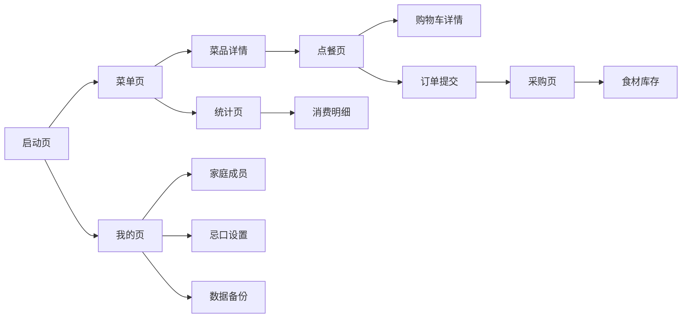

# 家庭点菜小程序 UI 设计规格文档

> 项目名称：自用家庭点菜微信小程序  
> 设计工具：Ardot 画布设计稿（含 5 个主页面原型）  
> 配套 PRD：`family-order-prd.md`

---

## 1. 设计原则

### 1.1 用户场景驱动

- **家庭多人协作**：界面需同时满足老人（视觉清晰）、孩子（操作直觉）、管理员（信息完整）三类角色。
- **高频操作最短路径**：点餐、看菜单、查采购清单都能在底部导航一键直达。
- **离线可用**：核心操作不依赖网络，断网时数据暂存本地。

### 1.2 核心体验关键词

| 关键词 | 设计体现 |
|--------|----------|
| 温暖家庭感 | 米白背景 + 暖橙主色 + 圆角卡片 |
| 老人友好 | 大字体、大按钮、高对比文字、底部固定导航 |
| 孩子友好 | 菜品图优先、图标化按钮、加减份数大按钮 |
| 简洁无广告 | 无浮窗、无 Banner、无多余营销元素 |

---

## 2. 视觉风格体系

### 2.1 色彩规范

#### 浅色模式

| 颜色用途 | 色值 | 使用场景 |
|----------|------|----------|
| 主色 Primary | `#F4A261` | 选中态、主按钮、价格、高亮标签 |
| 深主色 Deep Primary | `#E07856` | 菜品图片底色、强调图标 |
| 背景 Background | `#F8F3EC` | 页面背景、状态栏背景 |
| 卡片 Surface | `#FFFFFF` | 内容卡片、底部导航 |
| 主文本 On Surface | `#2A1F14` | 标题、正文 |
| 次要文本 On Surface Muted | `#6B5B47` | 说明文字、未选中 Tab |
| 分割线 Divider | `#E8DCC8` | 边框、分割线 |
| 成功/勾选 | `#F4A261` | 采购清单选中态 |

#### 深色模式

| 颜色用途 | 色值 | 使用场景 |
|----------|------|----------|
| 背景 Background | `#1A1410` | 深色页面背景 |
| 卡片 Surface | `#2A2018` | 深色内容卡片、底部导航 |
| 主文本 On Surface | `#F5EFE8` | 深色标题、正文 |
| 次要文本 | `#A89A8C` | 深色说明文字 |
| 主色 Primary | `#F4A261` | 保持不变 |

### 2.2 字体规范

- 中文字体：`PingFang SC` / `Sarasa Gothic SC`（备选）
- 英文字体：`Inter` / `SF Pro`
- 字号梯度：
  - 页面大标题：22px / Bold
  - 卡片标题/菜名：16px / Bold
  - 正文/按钮文字：14–15px / Regular
  - 辅助说明：12px / Regular
  - 底部导航标签：10px / Regular

### 2.3 圆角与阴影

- 页面主卡片：`cornerRadius = 16px`
- 底部导航药丸：`cornerRadius = 36px`
- 菜品图片：`cornerRadius = 12px`
- 小按钮/加减按钮：`cornerRadius = 16px`
- 卡片阴影：`{ x: 0, y: 2, radius: 12, opacity: 0.08 }`

---

## 3. 页面总览

| 页面 | 文件名示意 | 核心功能 | 设计稿节点 |
|------|------------|----------|------------|
| 菜单页 | menu | 浏览、搜索、分类筛选菜品 | `3:1` |
| 点餐页 | order | 今日点餐、加购、购物车 | `7:17` |
| 采购页 | purchase | 采购清单、批量勾选、复制 | `8:2` |
| 统计页 | stats | 消费趋势、月度概览、高频菜 | `8:59` |
| 我的页 | profile | 家庭成员、忌口、数据备份 | `8:116` |

---

## 4. 页面设计说明

### 4.1 菜单页

**布局结构**

```
┌────────────────────────────┐
│  搜索栏                        │
│  [全部] [家常菜] [荤菜] [素菜] [汤品] [主食]  │
│  ┌─────────┐ ┌─────────┐   │
│  │ 菜品图   │ │ 菜品图   │   │
│  │ 菜名     │ │ 菜名     │   │
│  │ 标签     │ │ 标签     │   │
│  └─────────┘ └─────────┘   │
│  ┌─────────┐ ┌─────────┐   │
│  │ 菜品图   │ │ 菜品图   │   │
│  └─────────┘ └─────────┘   │
│                              │
│  [菜单] [点餐] [采购] [统计] [我的]  │
└────────────────────────────┘
```

**关键交互**

- 分类 Tab 横向滚动，当前选中高亮暖橙色。
- 菜品卡片点击跳转菜品详情（后续新增页面）。
- 卡片长按弹出管理员菜单（编辑/删除/上下架）。

**设计要点**

- 图片占位用渐变色，实际图片覆盖在上方。
- 菜名字号 16px，标签 12px，辅助色。

---

### 4.2 点餐页

**布局结构**

```
┌────────────────────────────┐
│  今日点餐      [历史记录]      │
│  ┌─────────┐ ┌─────────┐   │
│  │ 菜品图 + │ │ 菜品图 + │   │
│  │ 菜名     │ │ 菜名     │   │
│  │ 标签     │ │ 标签     │   │
│  └─────────┘ └─────────┘   │
│                              │
│  ┌────────────────────────┐│
│  │  🛒 已选 3 道菜 · 5 份 [查看] ││
│  └────────────────────────┘│
│  [菜单] [点餐] [采购] [统计] [我的]  │
└────────────────────────────┘
```

**关键交互**

- 菜品卡片右上角橙色圆形「+」按钮，点击加入购物车。
- 购物车摘要条点击展开购物车详情弹窗。
- 历史记录 Tab 切换到历史订单列表。

**设计要点**

- 当前页点餐 Tab 高亮为药丸背景。
- 购物车摘要条吸底，避免被键盘遮挡。

---

### 4.3 采购页

**布局结构**

```
┌────────────────────────────┐
│  采购清单              [ + ]  │
│  [☑ 批量勾选]        [📋 复制清单]  │
│  ┌────────────────────────┐│
│  │ ☑ 西红柿      2斤  ¥8  ││
│  │ ☑ 排骨        1斤  ¥35 ││
│  │ ☐ 紫菜        1包  ¥5  ││
│  └────────────────────────┘│
│                              │
│  [菜单] [点餐] [采购] [统计] [我的]  │
└────────────────────────────┘
```

**关键交互**

- 左侧复选框切换已购/未购状态。
- 右上角「+」添加临时采购项。
- 「复制清单」生成文本格式的采购清单，便于粘贴到微信。

**设计要点**

- 已勾选项文字可降低透明度或加删除线（开发实现时）。
- 价格统一用暖橙色，强调成本感。

---

### 4.4 统计页

**布局结构**

```
┌────────────────────────────┐
│  饮食统计                      │
│  [本月] [上月] [本周]            │
│  ┌────────────────────────┐│
│  │ 月度消费趋势               ││
│  │   ▁▂▃▁▅▂▁               ││
│  └────────────────────────┘│
│  ┌────────────────────────┐│
│  │ 本月消费概览               ││
│  │ 买菜支出           ¥1,280 ││
│  │ 半成品支出           ¥320  ││
│  │ 总计              ¥1,600  ││
│  └────────────────────────┘│
│  ┌────────────────────────┐│
│  │ 高频爱吃菜品 TOP5          ││
│  │ 1. 番茄炒蛋 (12次) 🏆     ││
│  │ 2. 红烧排骨 (8次) ❤️      ││
│  └────────────────────────┘│
│  [菜单] [点餐] [采购] [统计] [我的]  │
└────────────────────────────┘
```

**关键交互**

- 月份 Tab 切换时间维度，图表与数据联动更新。
- 高频菜点击进入菜品详情或历史订单。

**设计要点**

- 图表采用橙色柱状图，不同柱用透明度区分。
- 当前未完整月份用灰色柱表示。

---

### 4.5 我的页

**布局结构**

```
┌────────────────────────────┐
│  ┌────────────────────────┐│
│  │ 👨  爸爸                ││
│  │     管理员              ││
│  └────────────────────────┘│
│  ┌────────────────────────┐│
│  │ 家庭成员                 ││
│  │ 👩妈妈 👧女儿 👴爷爷 [+] ││
│  └────────────────────────┘│
│  ┌────────────────────────┐│
│  │ 功能菜单                 ││
│  │ 🥗 忌口设置            ›  ││
│  │ 📦 食材库存            ›  ││
│  │ 💾 数据备份            ›  ││
│  │ 🌙 深色模式        [开关] ││
│  └────────────────────────┘│
│  [菜单] [点餐] [采购] [统计] [我的]  │
└────────────────────────────┘
```

**关键交互**

- 家庭成员头像点击进入成员详情/编辑。
- 点击「+」添加新家庭成员。
- 深色模式开关切换全局主题。

**设计要点**

- 头像使用 emoji 大图标，醒目且亲切。
- 功能菜单采用左图标 + 右箭头的标准列表样式。

---

## 5. 组件规范

### 5.1 底部导航栏（Tab Bar）

- 药丸形容器，白色背景，悬浮于页面底部安全区上方。
- 5 个 Tab：菜单、点餐、采购、统计、我的。
- 当前选中 Tab：暖橙色药丸背景，图标和文字白色。
- 未选中 Tab：棕色图标和文字。

### 5.2 菜品卡片

- 尺寸：170 × 220px（设计稿，开发可适配 rpx）。
- 结构：图片区（120px） + 菜名（16px） + 标签（12px）。
- 状态：
  - 正常：白色卡片 + 阴影。
  - 已下架/售罄：图片区灰度 + 角标「已下架」。
  - 过敏拦截：红色角标或红色边框提示。

### 5.3 按钮规范

| 按钮类型 | 尺寸 | 颜色 | 圆角 | 使用场景 |
|----------|------|------|------|----------|
| 主按钮 | 56px 高 | `#F4A261` 底 + 白字 | 28px | 提交订单、保存菜品 |
| 次按钮 | 44px 高 | 白色底 + 棕边 | 22px | 取消、返回 |
| 图标按钮 | 32 × 32px | `#F4A261` 圆 | 16px | 加购、添加 |

### 5.4 弹窗规范

- 菜品详情弹窗：从底部滑出（类似微信 action sheet），避免打断当前浏览。
- 确认弹窗：标题 + 说明 + 双按钮（确认/取消）。
- 提示 Toast：底部居中，无按钮，2 秒自动消失。

---

## 6. 适配规范

### 6.1 手机端适配

- 设计稿基于 iPhone 14 尺寸（390 × 844 px）。
- 实际开发使用 `rpx` 或 `vw` 单位，保证在安卓/苹果手机上缩放一致。
- 底部导航留出安全区高度（83px）。

### 6.2 深色模式

- 所有颜色使用 CSS 变量，支持 `prefers-color-scheme` 或手动切换。
- 图片在深色模式下降低亮度或保持原样。

### 6.3 适老化要求

- 正文最小字号 14px，标题 22px。
- 按钮可点击区域不小于 44 × 44px。
- 图标与文字配合使用，避免纯图标造成理解障碍。

---

## 7. 页面流程图



---

## 8. 设计稿交付清单

| 设计稿 | 截图路径 | 画布节点 |
|--------|----------|----------|
| 菜单页 | `.workbuddy/screenshots/screenshot(3_1)-20260702_115600.webp` | `3:1` |
| 点餐页 | `.workbuddy/screenshots/screenshot(7_17)-20260702_115600.webp` | `7:17` |
| 采购页 | `.workbuddy/screenshots/screenshot(8_2)-20260702_122322.webp` | `8:2` |
| 统计页 | `.workbuddy/screenshots/screenshot(8_59)-20260702_122322.webp` | `8:59` |
| 我的页 | `.workbuddy/screenshots/screenshot(8_116)-20260702_122322.webp` | `8:116` |

画布设计稿在线地址：`https://ardot.tencent.com/file/699465594818587`
